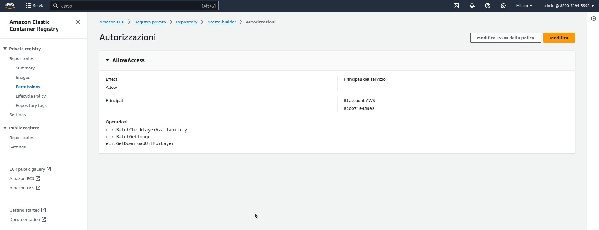

# ricette

## Plugin usati

- https://github.com/daviddrysdale/mdbook-indexing

## Template

```


{{hi:Pomodoro}}

## Ingredienti

| Ingredienti                  | Ingredienti             |
| ---------------------------- | ----------------------- |
| **** -  | **** - |
| **** - | **** - |
| **** - | **** - |
| **** - | **** - |
| **** - | **** - |
| **** - | **** - |
| **** - | **** - |
| **** - | **** - |
| **** - | **** - |

## Procedimento

1. 

```

## Indici

`{{hi:Testo}}`

## Docker image

Per testare l'immagine docker di build:

```bash
docker build -t ricette-aws-build .

docker run --rm -ti -v $(pwd):/ricette -v $(pwd)/book-out: ricette-aws-build bash
```

## AWS

### ElasticContainerRegistry

Le permission policies del registry devono essere impostate come segue:

```json
{
  "Version": "2012-10-17",
  "Statement": [
    {
      "Sid": "AllowAccess",
      "Effect": "Allow",
      "Principal": {
        "AWS": "arn:aws:iam::820071945992:root"
      },
      "Action": [
        "ecr:BatchCheckLayerAvailability",
        "ecr:BatchGetImage",
        "ecr:GetDownloadUrlForLayer"
      ]
    }
  ]
}
```



### CodeBuild

La policy del progetto di compilazione deve avere una policy collegata fatta come segue (ovviamente l'ARN dipende dal repo ECR):

```json
{
    "Version": "2012-10-17",
    "Statement": [
        {
            "Sid": "Statement1",
            "Effect": "Allow",
            "Action": [
                "ecr:BatchCheckLayerAvailability",
                "ecr:BatchGetImage",
                "ecr:GetDownloadUrlForLayer"
            ],
            "Resource": [
                "arn:aws:ecr:eu-south-1:820071945992:repository/ricette-builder"
            ]
        },
        {
            "Sid": "Statement2",
            "Action": [
                "codecommit:GitPull"
            ],
            "Resource": "*",
            "Effect": "Allow"
        }
    ]
}
```

### Build dell'immagine docker e push in ECR

```bash
docker build -t ricette-aws-build .
aws ecr get-login-password --region eu-south-1 | docker login --username AWS --password-stdin 820071945992.dkr.ecr.eu-south-1.amazonaws.com
docker tag ricette-aws-build:latest 820071945992.dkr.ecr.eu-south-1.amazonaws.com/ricette-builder:1.0
docker tag ricette-aws-build:latest 820071945992.dkr.ecr.eu-south-1.amazonaws.com/ricette-builder:latest
docker push 820071945992.dkr.ecr.eu-south-1.amazonaws.com/ricette-builder:1.0
docker push 820071945992.dkr.ecr.eu-south-1.amazonaws.com/ricette-builder:latest
```

# Appunti

File passati:

- `_ricette_lievito_madre`
- `_ricette_antipasti`
- `_ricette_ varie`
- `_ricette_Pane`
- `_ricette secondi`

In lavorazione:

- `_ricette_dolci`
