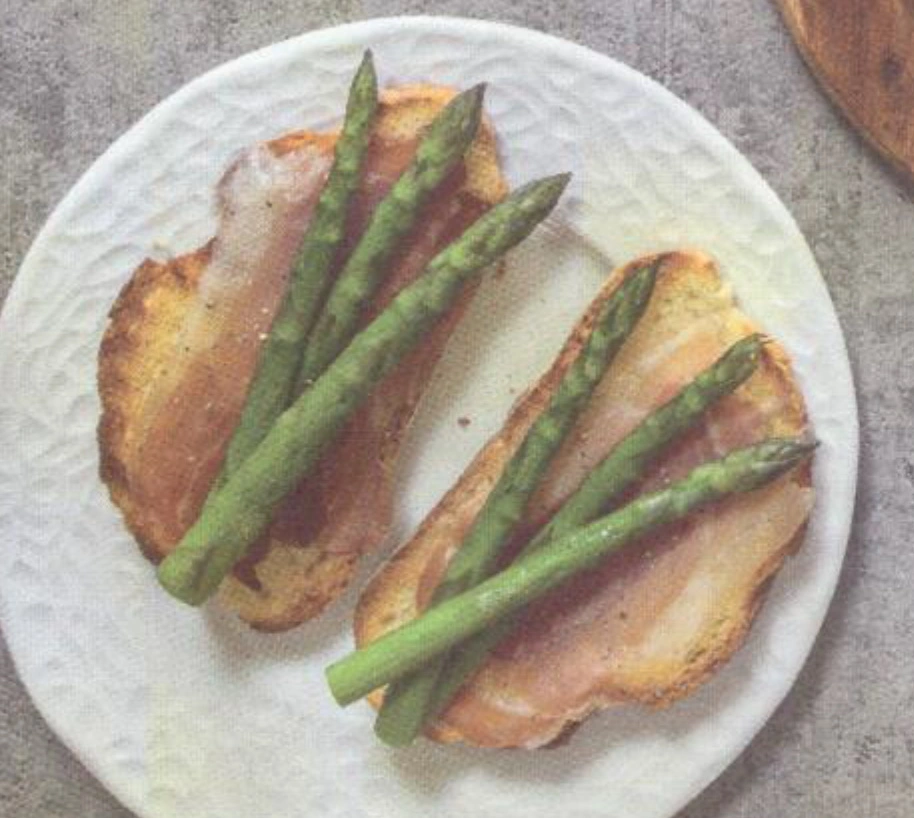

---
tags:
  - Asiago
  - Speck
  - Asparagi
---
# Bruschette con Asiago grigliato, speck e asparagi

## Ingredienti

| Ingredienti                  | Ingredienti             |
| ---------------------------- | ----------------------- |
| **150 g** - Asparagi | Olio evo |
| **200 g** - Asiago | Sale |
| Pane da bruschette | |

## Procedimento

1. Pulite gli asparagi e lessateli in abbondante acqua salata per circa 8 minuti. Scolateli e conditeli con olio extravergine di oliva e sale.
1. Tagliate l'Asiago a fette non troppo sottili e grigliatele su una griglia ben calda insieme a 4 fette di pane casereccio.
1. Mettete il formaggio grigliato sulle fette di pane, aggiungete una fetta di speck e gli asparagi.
1. Infornate per 5 minuti sotto il grill.
1. Finite con sale e pepe.
