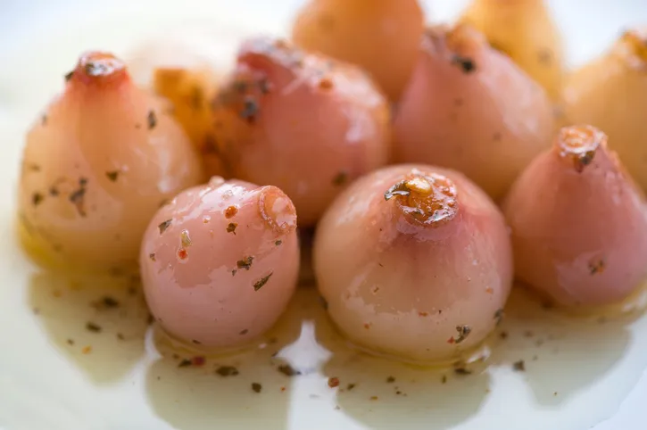
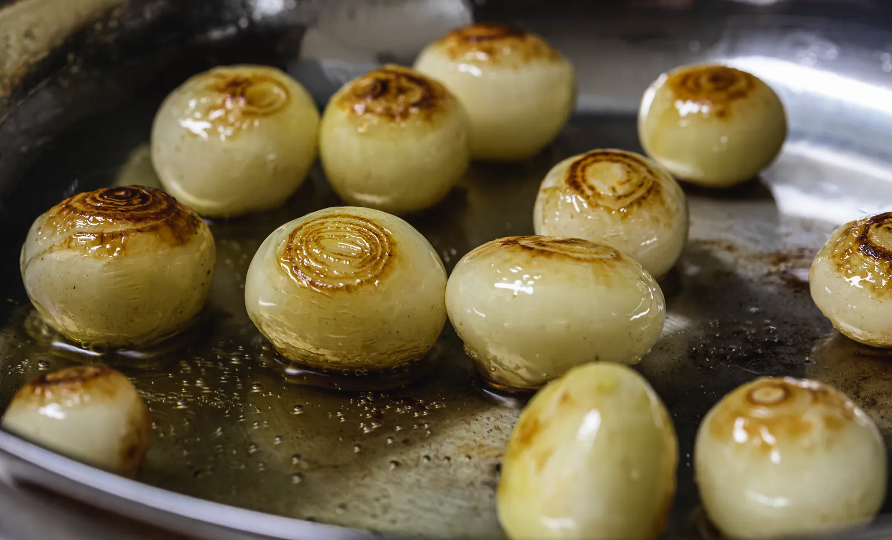

---
tags:
  - Cipolline
---

## Ingredienti

| Ingredienti                  | Ingredienti             |
| ---------------------------- | ----------------------- |
| **800 g** - Cipolline borretane | **500 ml** - Aceto di vino bianco |
| **500 ml** - Acqua | **2 foglie** - Alloro |
| Olio evo | Pepe nero in grani |
| Sale | |

## Procedimento

1. Sbucciate le cipolline borretane e lavatele molto bene sotto l’acqua corrente. 
2. Versate all'interno di una pentola l’acqua, l’aceto e un pizzico di sale. Quando l'acqua sta per bollire aggiungete le cipolline. 
3. Abbassate la fiamma al minimo e fate cuocere per 10 minuti o fino a che saranno morbide e sarà possibile infilzarle con una forchetta.
4. Scolate le cipolline fatele asciugare completamente su un canovaccio pulito prima di invasarle. 5. Saranno necessarie diverse ore (anche 12) ma si tratta di un passaggio fondamentale per la perfetta riuscita e per scongiurare la comparsa di muffe.
5. Quando le cipolline saranno perfettamente asciutte mettetele all'interno dei barattoli sterilizzati aggiungendo grani di pepe e foglie di alloro lavate e asciugate. 
6. Nel riempire i barattoli non arrivate sino all'orlo e aiutatevi con una forchetta per schiacciarle delicatamente ed eliminare eventuali bolle d’aria.
7. Versate nei barattoli l'olio extravergine di oliva fino a coprire completamente le cipolline. 
8. Chiudete con i coperchi e per creare il sottovuoto disponete i barattoli all'interno di una pentola con acqua fredda e un canovaccio (necessario affinché i barattoli non si tocchino tra loro). 
9. Portate a bollore e fare cuocere per circa 20 minuti. Spegnete e lasciate raffreddare i vasetti nell'acqua.
10. Riponete i barattoli delle cipolline sott'olio in un luogo fresco al riparo dalla luce del sole e non le consumate prima di una settimana. 
11. Dopo l'apertura del vasetto, conservate in frigo e consumate entro pochi giorni.

## Note

- **Cipolline sott'olio grigliate**: Se volete una conserva dal sapore ancora più deciso, potete arrostire o grigliare le cipolline dopo averle sbollentate in acqua e aceto prima di metterle sott'olio.

    

- Se desiderate, in base ai vostri gusti, potete aggiungere alla vostra conserva altre spezie e aromi come timo, peperoncino fresco, origano, aglio o pepe rosa in grani.