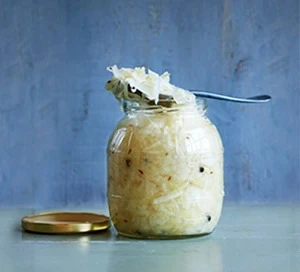

---
tags:
  - Cappuccio
---
# Sauerkraut

## Ingredienti

| Ingredienti                  | Ingredienti             |
| ---------------------------- | ----------------------- |
| **2 Kg** - Very firm, pale green or white cabbage | **1 tbsp** - Caraway seeds (cumino) |
| **2 tbsp** - Coarse crystal sea salt | **1 tbsp** - Peppercorns (pepe nero) |

## Procedimento

1. Thoroughly wash a large tub or bowl (we used on the size of a small washing-up bowl), then rinse with boiling water from the kettle. Make sure that your hands, and everything else coming into contact with the cabbage, are very clean. It's wise to use a container that will comfortably fit the softened cabbage, allowing several inches of room at the top to avoid overflow.
1. Shred the cabbage thinly - a food processor makes light work of this. Layer the cabbage and the salt in the tub or bowl. Massage the salt into the cabbage for 5 mins, wait 5 mins, then repeat. You should end up with a much-reduced volume of cabbage sitting in its own brine. Mix in the caraway seeds and the peppercorns.
1. Cover the surface of the cabbage entirely with a sheet of cling film, then press out all the air bubbles from below. Weigh the cabbage down using a couple of heavy plates, or other weights that fit your bowl, and cover as much of the cabbage as possible. The level of the brine will rise to cover the cabbage a little. Cover the tub and leave in a dark place at a cool room temperature (about 18-20°) for at least five days. It will be ready to eat after five days, but for maximum flavour leave the cabbage to ferment for anywhere between 2-6 weeks (or until the bubbling subsides).
1. Check the cabbage every day or so, releasing any gases that have built up as it ferments, giving it a stir to release the bubbles. If any scum forms, remove it, rinse the weights in boiling water and replace the cling film. You should see bubbles appearing within the cabbage, and possibly some foam on the top of the brine. It's important to keep it at an even, cool room temperature - too cool and the ferment will take longer than you'd like, too warm and the sauerkraut may become mouldy or ferment too quickly, leading to a less than perfect result.
1. The cabbage will become increasingly sour the longer it's fermented, so taste it now and again. When you like the flavour, transfer it to smaller sterilised jars. Will keep in the fridge for up to six months.

## Note

- **Cabbage know-how** Weigh the cabbage once trimmed, so that the proportion of salt to cabbage (15 g per 500 g) is correct.
- **The perfect brine** If your cabbage isn't submerged in about 1 cm depth of liquid after 24 hours, add some extra brine. Dissolve 1 tsp salt, (always use pure sea salt), into 250 ml water and add, or multiply and add enough to cover the cabbage.
- **When to eat** As long as your sauerkraut isn't mouldy or discoloured, it's safe to eat at any point.
- **Source of vitamins** Being uncooked, fermented vegetables have their vitamins locked in, providing a great dose of vitamin C in particular. Lactobacillus, meanwhile, supports the guy and immune system.
- **Serving suggestion** Serving your sauerkraut fresh from the jar is the best way to maintain all the goodness packed in there - it's like eating a pot of friendly-bacteria yogurt every morning.
- **Cooking with sauerkraut** Heating does kill the bacteria, but don't let that put you off some of the delivious recipes you can make with sauerkraut - you'll still be getting an excellent source of vitamins and fibre, as well as that homemade flavour.
