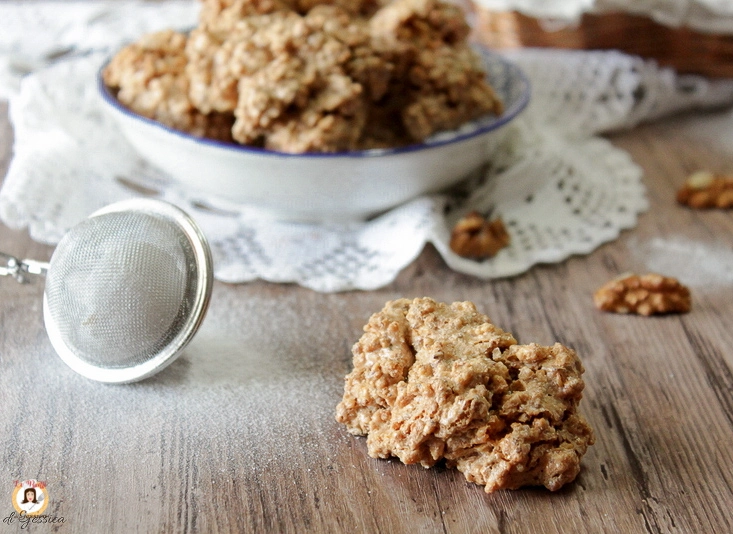

---
tags:
  - Noci
  - Mandorle
  - Nocciole
---

## Ingredienti

| Ingredienti                  | Ingredienti             |
| ---------------------------- | ----------------------- |
| **75 g** - Albumi (3 uova) | **150 g** - Noci (o mandorle o nocciole) |
| **150 g** - Zucchero a velo | **1 pizzico** - Vaniglia |

## Procedimento

> Preriscaldarte il forno a 150°

1. Iniziate a tritare le noci (o qualsiasi altra frutta secca) in un mixer, fino ad ottenere un farina grossolana. Mettetela da parte.
2. Montate a neve gli albumi. A metà preparazione versate lo zucchero a velo. 
3. Continuate a montare la meringa, fino ad ottenere un composto schiumoso e morbido, ma allo stesso tempo sodo.
4. Dopo, versate la farina di noci (o di nocciole o mandorle). Continuate a montare con le fruste. Insaporite con la vanillina.
5. Trasferite il composto dentro un pentolino. Accendete il fuoco e cuocetelo a fiamma bassa, sempre mescolandolo (attenzione perchè tende a bruciarsi) per circa 10/15 minuti. 
6. Sarà pronto quando si sarà asciugato e sarà diventato più compatto e dal colore ambrato. Al termine spegnete il fuoco.
7. Rivestite, con della carta forno, una leccarda. Formate I BISCOTTI BRUTTI MA BUONI prelevando il composto a cucchiaiate. Ogni biscotto dovrà essere grande quanto una noce.
8. Cuocete i BISCOTTI BRUTTI MA BUONI ALLE NOCI in forno caldo a 150° per circa 15/20 minuti (ventilato) a 130° per circa 30-40 minuti (forno statico). Regolatevi con il vostro forno. 
9. I brutti ma buoni, saranno cotti quando il composto si sarà asciugato e diventato duro.