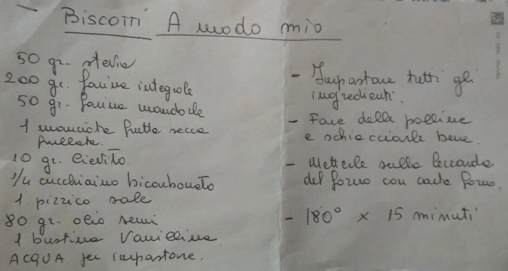

---
tags:
  - Biscotti
  - Avena
---
# Biscotti a modo mio

## Ingredienti

| Ingredienti | Ingredienti |
| --- | --- |
| **50 g** - Avena | **200 g** - Farina integrale |
| **50 g** - Farina manitoba | **1 manciata** - Frutta secca frullata |
| **10 g** - Lievito | **1/2 cucchiaino** - Bicarbonato |
| **1 pizzico** - Sale | **80 g** - Olio di semi |
| **1 bustina** - Vanillina | Acqua per l'impasto |

## Procedimento

> Preriscaldare il forno a 180°

1. Impastare tutti gli ingredienti.
2. Fare delle palline e schiacciare bene.
3. Mettere sulla leccarda del forno con carta forno.
4. Cuocere a 180° per 15 minuti.
