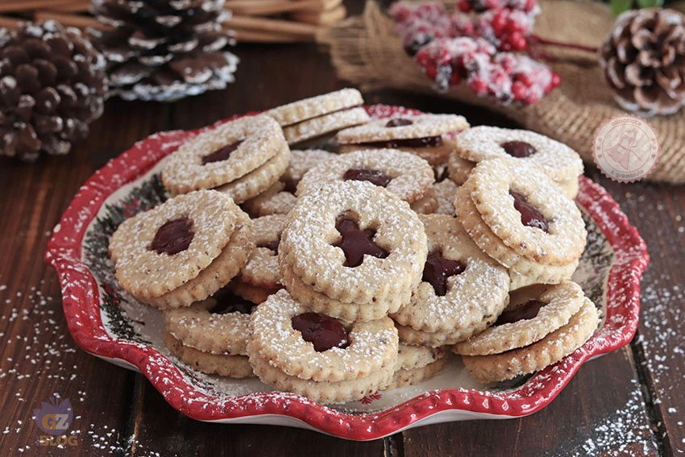

---
tags:
  - Farina di nocciole
---

## Ingredienti

| Ingredienti                  | Ingredienti             |
| ---------------------------- | ----------------------- |
| **200 g** - Farina 00 | **120 g** - Burro |
| **100 g** - Zucchero | **100 g** - Farina di nocciole |
| Cannella | Sale |
| MArmellata di mirtilli rossi | |

## Procedimento

> Preriscaldare il forno a 180°

1. Iniziate mettendo nella ciotola dell’impastatrice il burro a pezzi insieme allo zucchero.
2. Iniziate ad impastare e amalgamare gli ingredienti.
3. Unite l’uovo intero, la farina 00 e la cannella in polvere.
4. Aggiungete la farina di nocciole e un pizzico di sale.
5. Impastate tutti gli ingredienti poi mettete il panetto di impasto avvolto nella pellicola trasparente e fatelo riposare in frigo per circa 1 ora.
6. Prendete l’impasto dopo averlo fatto riposare e mettetelo tra due fogli di carta forno.
7. Stendete la pasta frolla con il matterello fino ad arrivare a uno spessore di pochi millimetri.
8. Create con una formina da biscotti tanti piccoli cerchi di uguale dimensione.
9. Mettete tutti i biscotti su una teglia con carta forno e in metà dei biscotti fate un buco al centro, volendo con la decorazione.
10. Cuocete i biscotti in forno preriscaldato ventilato a 180° per 10 minuti circa fino a che saranno cotti.
11. Sfornate i biscotti e lasciateli raffreddare completamente.
12. Prendete la base di biscotto e mettete sopra un cucchiaino di confettura di mirtilli rossi. Posizionate il biscotto con il buco decorato sopra all’altro e premete leggermente in modo da far aderire i due biscotti con al centro la confettura.
13. Terminate i biscotti linzer con una spolverata di zucchero a velo.
