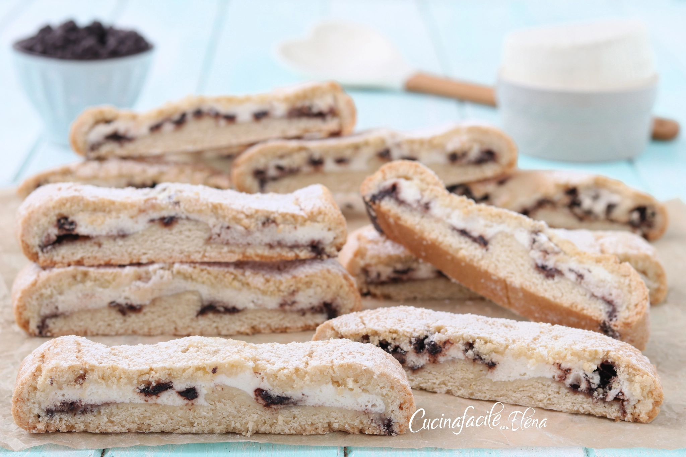

---
tags:
  - dolci
  - biscotti
  - ricotta
  - cioccolato
---

# Biscottoni alla ricotta

## Ingredienti

### Impasto

| Ingredienti | Ingredienti |
| ----------- | ----------- |
| **300 g** - farina 00 | **100 g** - zucchero |
| **100 g** - burro | **1** - uovo |
| **1 cucchiaino** - lievito in polvere per dolci | **1 pizzico** - sale |
| q.b. - vaniglia | |

### Ripieno

| Ingredienti | Ingredienti |
| ----------- | ----------- |
| **300 g** - ricotta | **50 g** - zucchero |
| **50 g** - gocce di cioccolato | q.b. - vaniglia |

## Procedimento

> Preriscaldare il forno a 180°

1. In una ciotola mettete la farina, lo zucchero, il lievito, la vaniglia, un pizzico di sale, il burro a temperatura ambiente e mescolate con una forchetta, fino ad ottenere un composto sbricioloso.
1. Aggiungete l'uovo e formate un panetto morbido e compatto, mettetelo in frigo, giusto il tempo di preparare il ripieno.
1. Mettete quindi in una ciotola la ricotta, lo zucchero, la vaniglia e mescolate. In una forchetta, incorporate poi le gocce di cioccolato.
1. Stendete la frolla a formare un rettangolo allungato, spessi circa mezzo cm, e farcite la parte centrale con la crema di ricotta.
1. Aiutandovi con la carta forno sottostante, chiudete il dolce piegando i laterali sopra il ripieno e sigillate bene i bordi.
1. Capovolgete il rotolo in modo che la parte della chiusura sia rivolta verso il basso e cuocetelo in forno preriscaldato a 180 gradi per 40 minuti circa, deve risultare dorato.
1. A cottura ultimata, sfornate il dolce, lasciatelo raffreddare, guarnitelo con una spolverata di zucchero a velo e tagliatelo a pezzi di circa 3 cm, ottenendo i biscottoni alla ricotta.

## Note

I biscottoni alla ricotta si conservano a temperatura per 2/3 giorni o in frigo fino a 4 giorni. Se non volete usare le gocce di cioccolato, potete tranquillamente ometterle, potete aromatizzare la ricotta con scorza di arancia o limone.

## Origine

[https://blog.giallozafferano.it/cucinafacileconelena/ricetta-biscottoni-alla-ricotta/](https://blog.giallozafferano.it/cucinafacileconelena/ricetta-biscottoni-alla-ricotta/)
