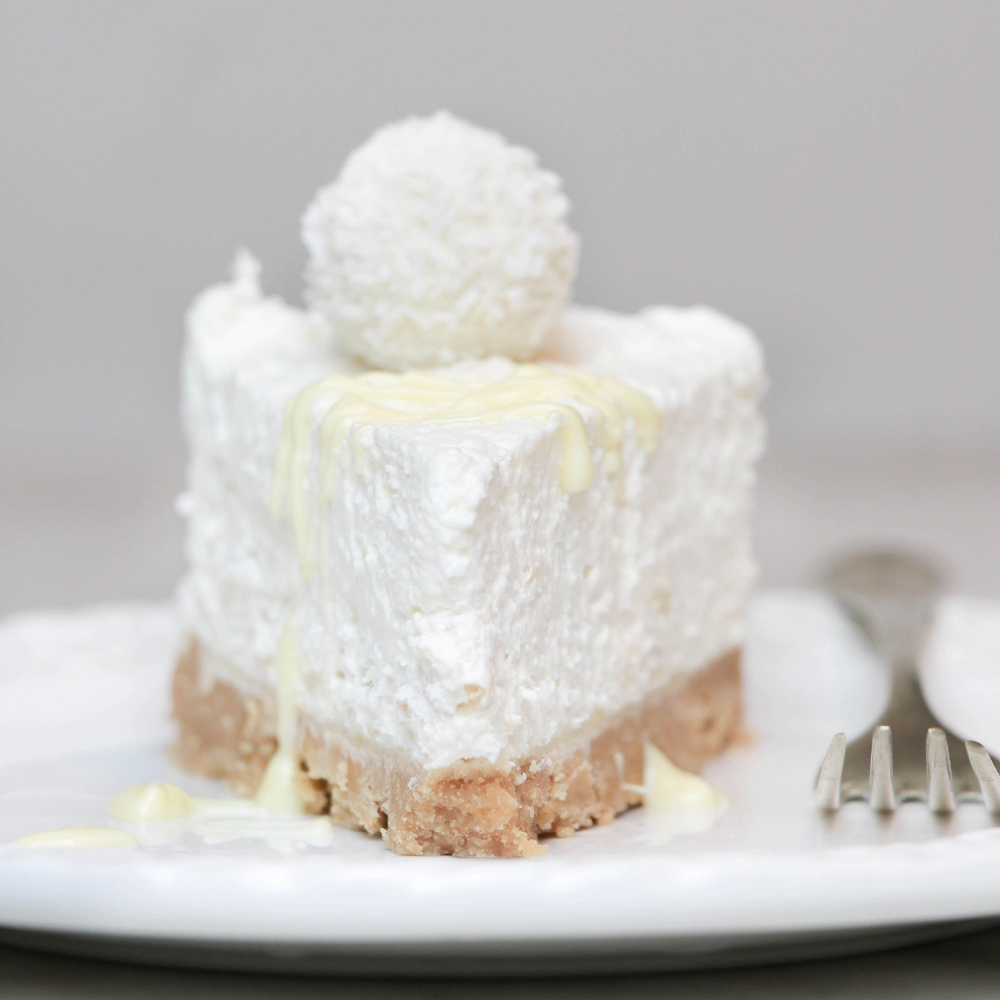

---
tags:
  - abc
---

## Ingredienti

### Base

| Ingredienti                  | Ingredienti             |
| ---------------------------- | ----------------------- |
| **200 g** - Biscotti | **130 g** - Burro |

### Cheesecake

| Ingredienti                  | Ingredienti             |
| ---------------------------- | ----------------------- |
| **250 g** - Ricotta | **250 g** - Panna |
| **100 g** - Cioccolato bianco | **50 g** - Zucchero a velo |
| **80 g** - Farina di cocco disidratata | **80 g** - Cioccolatini Raffaello |

## Procedimento

### Base

1. Tritare i biscotti in un frullatore, fino ad ottenere una consistenza farinosa. Mettere il tutto in una pirofila
2. Fondere il burro nel microonde e aggiungerlo ai biscotti sbriciolati; amalgamare bene e riporre in freezer mentre si prepara la crema

### Cheesecake

1. Fondere il cioccolato in microonde e lasciarlo intiepidire
2. Montare insieme la ricotta, la panna e lo zucchero a velo, fino ad ottenere una consistenza densa
3. Aggiungere il cioccolato e il cocco continuare a mescolare con la frusta elettrica.
4. Infine aggiungere i cioccolatini Raffaello, spezzandoli a mano grossolanamente sopra il composto cremoso. 
5. Mescolare a mano con un leccapentole
6. Prendere la base dal freezer, versare sopra la crema ottenuta e decorare con gli altri cioccolatini; riporre in frigorifero per almeno 3/4 ore
7. Servire decorandolo con altro cioccolato bianco, oppure sbranatelo anche così, che è perfetto! 
