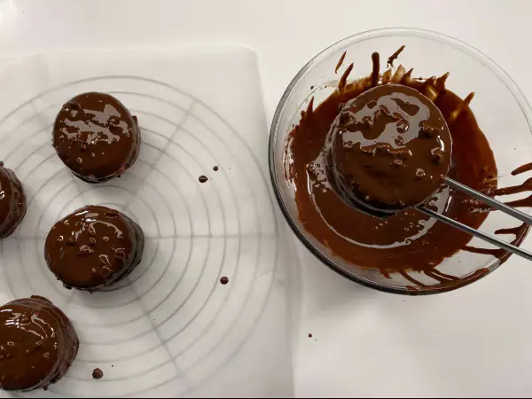

---
tags:
  - Cioccolato fondente
  - Panna
---
# Chocolate pie cake

## Ingredienti

### Per 5 tortine

| Ingredienti                  | Ingredienti             |
| ---------------------------- | ----------------------- |
| **2** - Uova | **30 g** - Farina 00 |
| **25 g** - Latte intero | **25 g** - Zucchero |
| **20 g** - Olio di semi | **3 g** - Succo di limone |

### Farcitura

| Ingredienti                  | Ingredienti             |
| ---------------------------- | ----------------------- |
| **200 g** - Cioccolato fondente | **100 g** - Panna fresca liquida |

### Glasse

| Ingredienti                  | Ingredienti             |
| ---------------------------- | ----------------------- |
| **150 g** - Cioccolato fondente | **50 g** - Olio di semi |
| **30 g** - Nocciole | |

## Procedimento

> Preriscaldare il forno a 160°

1. Per preparare le chocolate pie cake per prima cosa separate, in due ciotole, i tuorli dagli albumi. Nella ciotola degli albumi aggiungete lo zucchero e il succo di limone.
1. Unite anche il sale e montate fino ad ottenere un composto spumoso. Riponetelo in frigorifero.
1. In un’altra ciotola versate il latte e l’olio, mescolate velocemente, quindi aggiungete la farina. Mescolate per un paio di minuti con una frusta a mano.
1. Unite i tuorli e mescolate ancora una volta. Versate questo composto nella ciotola degli albumi montati a neve e mescolate dal basso verso l’alto per non smontare il composto. Riponete il composto in frigo intanto che preriscaldate il forno a 160°.
1. Mettete il composto in un sac-à-poche senza bocchetta e formate delle cupole su una teglia rivestita di carta forno; con queste dosi ne otterrete 10. Cuocete in forno a 160° per 30-35 minuti. Sfornate e lasciate raffreddare completamente.
1. Intanto preparate la ganache: tritate il cioccolato fondente e mettetelo in una ciotola, poi aggiungete la panna calda e mescolate fino a che tutto il cioccolato non si sarà sciolto.
1. Ponete la ciotola in un’altra più capiente riempita con acqua e ghiaccio. Lavorate con le fruste elettriche fino a che il composto non diventerà spumoso e cambierà colore.
1. Trasferite la ganache in un sac-à-poche e farcite 5 cupole, poi ricoprite con quelle rimaste. Tritate le nocciole.
1. In una ciotola mettete il cioccolato fondente tritato, aggiungete l’olio e fate sciogliere. Unite quindi le nocciole e mescolate.
1. Tuffate le tortine nel cioccolato, poi scolatele per rimuovere l'eccesso. Poggiatele su una griglia e lasciate rassodare la glassa. Le vostre chocolate pie cake al cioccolato sono pronte per essere gustate.

## Conservazione

Le chocolate pie cake si possono conservare in frigorifero, in un contenitore chiuso, per 2-3 giorni.

## Immagini

