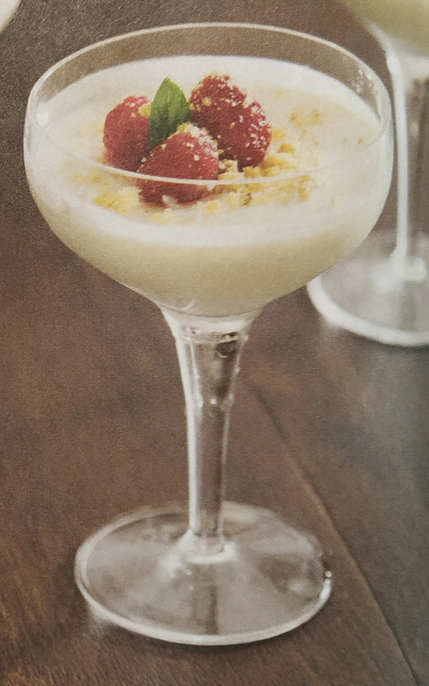

---
tags:
  - Lamponi
  - Sbrisolona
  - Panna
---
# Crema con lamponi\index{Lamponi} e sbrisolona

## Ingredienti

| Ingredienti                  | Ingredienti             |
| ---------------------------- | ----------------------- |
| **175 g** - Zucchero | **100 g** - Zucchero di canna |
| **125 g** - Lamponi | **120 ml** - Succo di limone |
| **900 ml** - Panna fresca | **60 ml** - Succo di arancia |

## Procedimento
    
1. Mettete lo zucchero e 50 ml di acqua in un padellino su fuoco basso e mescolate fino a quando lo zucchero si sarà sciolto.
1. Versate il liquido sui lamponi in una ciotola e lasciate macerare per 1 ora.
1. Mettete la panna, lo zucchero di canna, le bucce di limone e arancia in un padellino su fuoco medio-alto. Portate a bollore e lasciate cuocere per 3 minuti.
1. Unite i succhi, riportate a bollore e lasciate cuocere per altri 3 minuti.
1. Passate il mix di ingredienti in un colino e poi versate la crema setacciata nei bicchieri.
1. Lasciate riposare la crema nei bicchieri in frigo per almeno 3 ore. Guarnite con la sbrisolona e i lamponi macerati.

