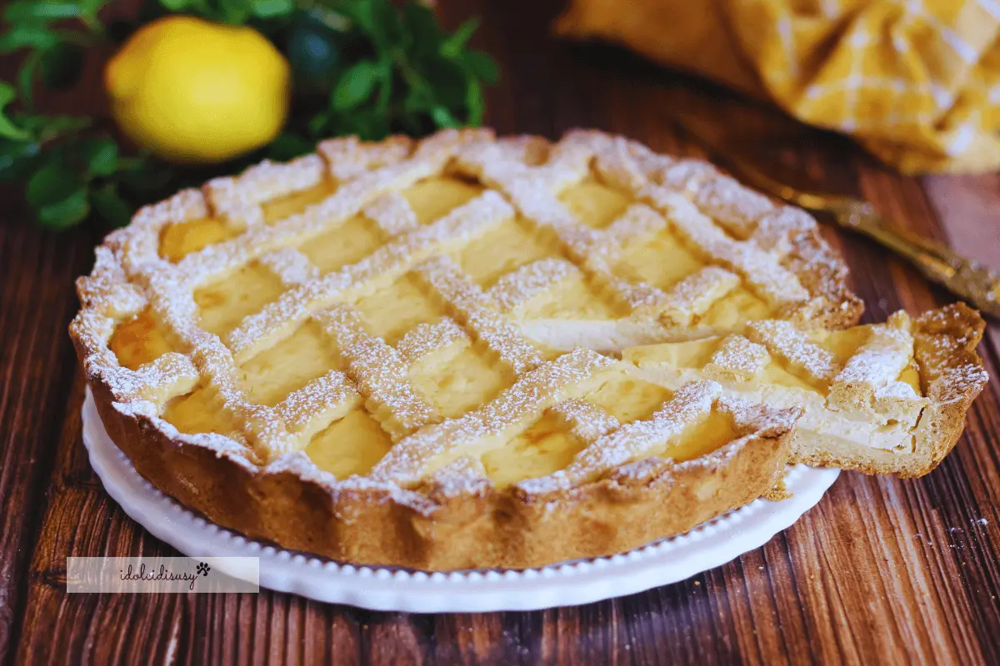

## Ingredienti

### Per la pasta frolla classica

| Ingredienti                  | Ingredienti             |
| ---------------------------- | ----------------------- |
| **300 g** - Farina 00 | **130 g** - Burro |
| **110 g** - Zucchero | **1** - Uovo |
| **1** - Tuorlo | Scorza di limone |
| Sale |  |

### Per il ripieno

| Ingredienti                  | Ingredienti             |
| ---------------------------- | ----------------------- |
| **500 g** - Ricotta vaccina | **40 g** - Zucchero a velo (4 cucchiai) |
| **20 g** - Amido di mais (1 cucchiaio) | **1** - Uovo |
| Scorza di limone | Succo di 1 limone |

## Procedimento

> Preriscaldare il forno a 180°C

1. In una ciotola metto la ricotta, lo zucchero a velo, l’amido di mais, l’uovo, la scorza di un limone grattugiata e il succo. 
2. Mescolo inizialmente con una spatola, poi proseguo con una frusta a mano per avere una crema liscia, vellutata e senza grumi.
3. Stendo la pasta frolla su una spianatoia leggermente infarinata e la posiziono sullo stampo crostata da 26 cm precedentemente imburrato e infarinato. 
4. Con le mani, la faccio aderire bene ai bordi e rimuovo l’eccesso di frolla, passando sopra il mattarello per rifinire i bordi.
5. Verso la crema di ricotta e livello la superficie. 
6. Decoro la crostata aggiungendo le strisce di frolla avanzata creando la classica griglia. 
7. Cuocio in forno statico preriscaldato a 180°C per circa 40-45 minuti, fino a doratura. 
8. Lascio raffreddare completamente prima di sformare.