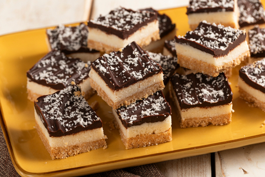

---
tags:
  - Cocco rapè
---

## Ingredienti

### Per la base (per uno stampo da 20x20 cm)

| Ingredienti                  | Ingredienti             |
| ---------------------------- | ----------------------- |
| **180 g** - Biscotti secchi | **155 g** - Burro |
| **60 g** - Cocco rapè | |

### Per la farcitura

| Ingredienti                  | Ingredienti             |
| ---------------------------- | ----------------------- |
| **200 g** - Cocco Rapè | **90 g** - Burro |
| **150 g** - Panna fresca liquida | **70 g** - Zucchero |

### Per la ganache

| Ingredienti                  | Ingredienti             |
| ---------------------------- | ----------------------- |
| **230 g** - Cioccolato fondente 55% | **100 g** - Panna fresca liquida |
| Cocco rapè | |

## Procedimento

1. Per prima cosa fate sciogliere il burro in un pentolino e lasciatelo intiepidire. 
2. Intanto mettete i biscotti secchi all’interno del mixer e frullate fino a ridurli in polvere. 
3. Trasferite il tutto in una ciotola e unite il cocco rapè.
4. Versate il burro fuso intiepidito e mescolate fino ad ottenere un composto sabbioso. 
5. Versatelo in uno stampo 20x20 cm foderato con carta forno e pressate con il dorso di un cucchiaio per livellarlo e compattarlo. 
6. Lasciate riposare in frigorifero per 5 minuti.
7. Intanto preparate la farcitura al cocco: in una pentola a fuoco dolce unite il burro, lo zucchero, la panna e mescolate per far sciogliere bene il burro.
8. Quando il composto sfiorerà il bollore versatelo sul cocco rapè che avrete messo in una ciotola, poi mescolate fino ad ottenere un composto omogeneo. 
9. Trasferite il composto nello stampo e pressate bene per formare uno strato compatto e uniforme. 
10. Lasciate riposare in frigorifero per altri 5 minuti.
11. Nel frattempo occupatevi della copertura: tritate il cioccolato fondente e scioglietelo a bagnomaria (o in microonde), poi trasferitelo in una ciotola. 
12. In un pentolino a parte portate la panna a sfiorare il bollore, poi aggiungetela al cioccolato fuso e amalgamate bene.
13. Lasciate intiepidire.
14. Riprendete lo stampo dal frigo, versate la ganache intiepidita sopra lo strato al cocco e spatolate con un cucchiaio. 
15. Infine spolverizzate con il cocco rapè. 
16. Riponete in frigorifero per almeno 4 ore.
17. Trascorso il tempo di raffreddamento sformate il dolce ed eliminate la carta forno, quindi tagliatelo per ricavare dei pezzi di forma quadrata.

## Note

- I cubotti cocco e cioccolato si possono conservare in frigorifero, in un contenitore ermetico, per 3 giorni.
- Potete sostituire il cioccolato fondente con quello extra fondente o al latte.
- Se desiderate potete aromatizzare lo strato al cocco con un pizzico di cannella o vaniglia.