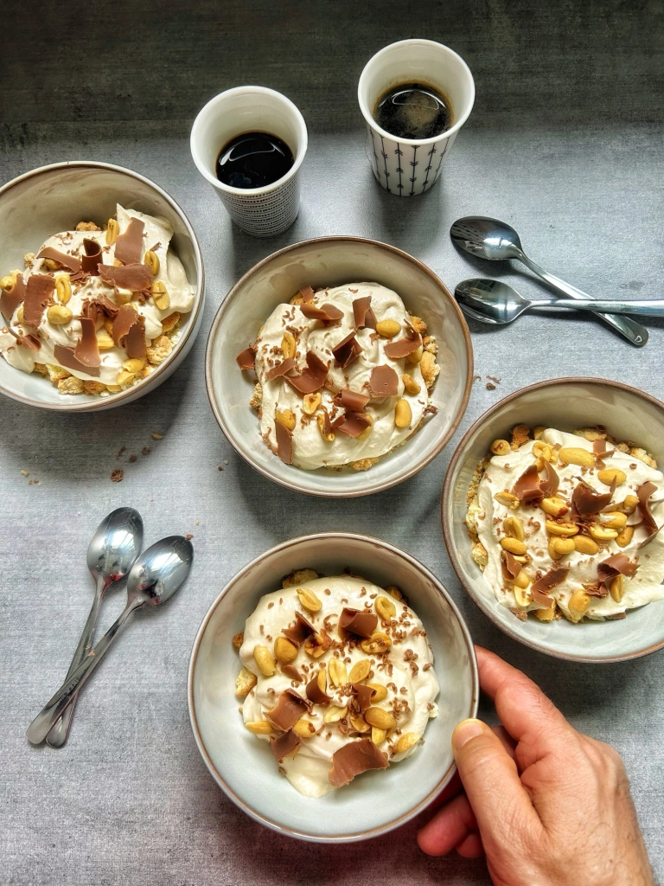

---
tags:
  - Ricotta
---
# Mousse alla ricotta e al caffè

## Ingredienti

| Ingredienti                  | Ingredienti             |
| ---------------------------- | ----------------------- |
| **150 ml** - Panna ad alto percentuale di grassi | **250 g** - Ricotta |
| **3 cucchiai** - Zucchero a velo | **2 cucchiai** - Caffè espresso forte |
| **2 cucchiai** - Marsala | Amaretti o cantucci sbriciolati (opzionale) |

## Procedimento

1. Montare la panna fino a formare dei picchi morbidi in una ciotola. Mettere da parte.
2. In una ciotola a parte, sbattere la ricotta e lo zucchero a velo fino a ottenere un composto omogeneo. 
3. Aggiungere il caffè e il marsala e sbattere fino a incorporarli. 
4. Incorporare la panna al composto di ricotta.
5. Distribuire nei recipienti prescelti (se lo si desidera, aggiungere dei biscotti) e raffreddare in frigorifero per almeno 2 ore prima di servire.
6. Per servire, se volete, grattugiare il cioccolato sulla superficie e cospargere con le nocciole tostate.

