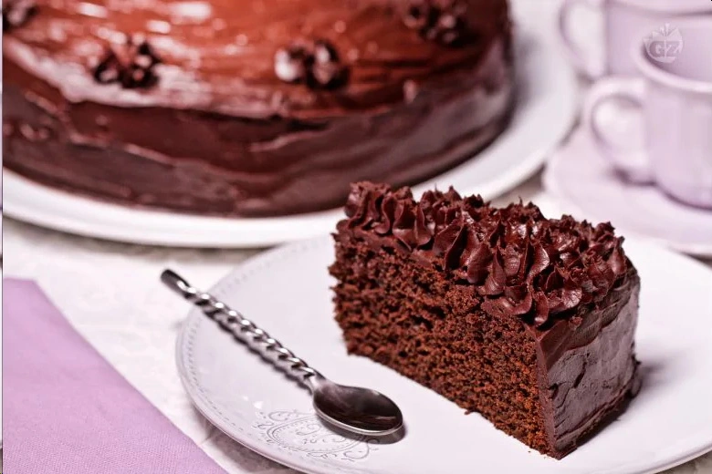
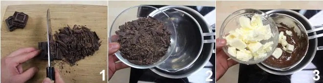
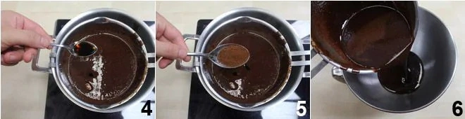
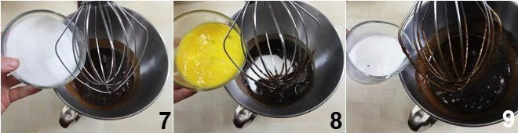
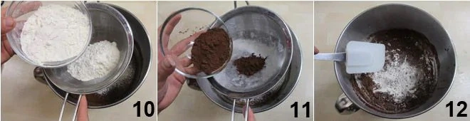
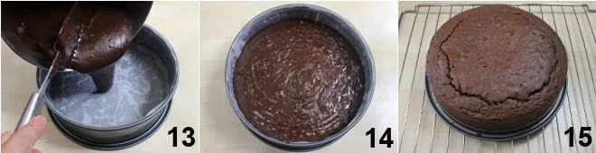
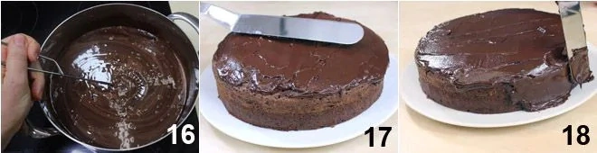

---
tags:
  - Cioccolato fondente
  - Cacao
  - Latticello
---
# Mud cake

## Ingredienti

| Ingredienti                  | Ingredienti             |
| ---------------------------- | ----------------------- |
| **200 g** - Cioccolato fondente | **100 ml** - Latticello |
| **30 g** - Cacao in polvere | **8 g** - Lievito in polvere per dolci |
| **250 g** - Burro | Estratto di vaniglia |
| **250 g** - Zucchero | **220 g** - Farina 00 |
| **3** - Uova | **1 cucchiaio** - Caffè solubile |

## Procedimento

> Preriscaldare il forno a 160°

1. Per preparare la mud cake iniziate a tritare il cioccolato fondente grossolanamente. Fatelo fondere a bagnomaria e quando sarà sciolto aggiungete il burro a pezzetti e fatelo sciogliere.
1. Quando il cioccolato e il burro saranno ben amalgamati unite l'estratto di vaniglia e il caffè solubile , quindi trasferite il composto in una planetaria ina una ciotola.
1. Lasciate intiepidire il composto e aggiungete lo zucchero e le uova sbattute con una forchetta : azionate la frusta uno sbattitore elettrico e mescolate. Aggiungete il latticello e continuate a mescolare alternativa al latticello potete usare la stessa dose di yogurt bianco magro.
1. Infine setacciate la farina direttamente nella ciotola insieme al lievito e il cacao in polvere e mescolate con un cucchiaio di legno o una spatola per amalgamare il composto.
1. Imburrate e coprite con della carta da forno una tortiera da 22 cm di diametro, quindi versateci l'impasto in modo uniforme. Infornate a 160°C statico per 60 minuti, trascorsi i quali verificherete l'avvenuta cottura con uno stuzzicadenti. Lasciate raffreddare la mud cake su di una gratella.
1. La mud cake può essere servita così oppure ricoperta da una ganache al cioccolato: scaldate la panna in un pentolino e quando avrà quasi raggiunto il bollore, a fuoco spento, aggiungete il cioccolato fondente tritato e mescolate con un frustino per sciogliere il cioccolato. 
1. Versate la ganache in un contenitore piuttosto largo e riponetela in frigorifero a raffreddare, mescolandola di tanto in tanto, fino a che avrà raggiunto una consistenza “spatolabile”. 
1. A questo punto trasferitela sulla mud cake e lisciatela con una spatola sulla superficie e sui lati. 
1. Se volete potete realizzare anche dei ciuffetti di ganache per decorazione. 

