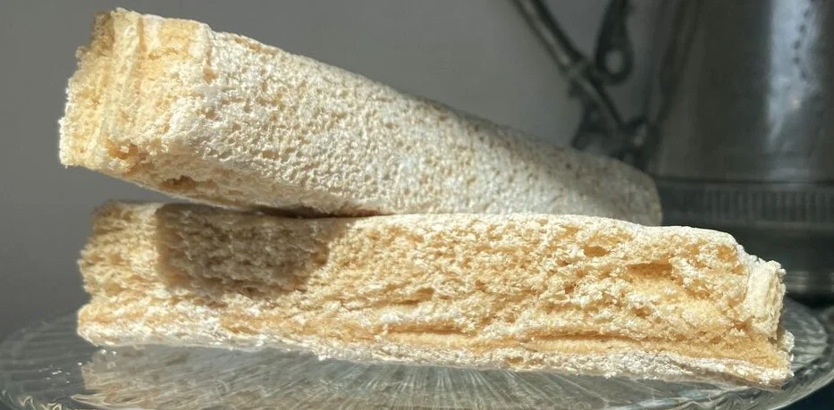

---
tags:
  - Mele
---
# Pastila

## Ingredienti

| Ingredienti                  | Ingredienti             |
| ---------------------------- | ----------------------- |
| **6** - Large apples (Granny Smiths) | **2** - Egg whites |
| **150 g** - Granulated sugar | Powdered sugar |

## Procedimento

> Preriscaldare il forno a 180°

1. Wash the apples, and place them into a shallow, oven-safe dish with a \nicefrac{1}{4} inch of water at the bottom. Then, roast the apples for an hour, or until they're golden, saggy, and wrinkly.
1. Remove the apples from the oven, and allow them to cool completely. (For now, turn off the oven.) Then, scrape the skins and cores until you have a mound of soft, seed-free puree. With a blender, process the puree until smooth.
1. Next comes the fun part. Put the puree, egg whites, and granulated sugar in the bowl of your stand mixer (or get out your handheld mixer and the largest mixing bowl you have). Whip the apple-sugar-egg mixture for 10 minutes, making sure to scrape down the sides occasionally.
1. Meanwhile, preheat the oven once again, this time to 180º F or the lowest setting it will go. Line a cookie sheet, including the sides, with parchment paper.
1. Back at the mixer, the puree will have nearly quadrupled in size after the 10 minutes. Stop the machine once you have a bowl filled with gleaming, thick white foam.
1. Scrape the foam into the pan, reserving about a cup and putting it in the fridge. Spread the foam in the pan evenly, and leave it in the oven for 4 hours.
1. Remove the pastila from the oven and allow it to cool completely. The pastila needs to be dry to the touch, and solid enough to pick up as one entire sheet without being extremely floppy. If not, return it to the oven.
1. With a knife dipped in hot water, cut the pastila into three identical pieces (yoùll want three rectangles instead of three long strips). Using the reserved puree as glue, stack the three pieces on top of each other, using the puree to patch any holes or fill any pits.
1. Then, on a baking sheet lined with more parchment paper, return the pastila to the oven once more, for an hour and a half. After making sure the layers have all molded together, remove it from the oven and let it cool.
1. When the pastila is cool, rub it all over with powdered sugar, and carefully slice down through the layers in inch-long increments (the resulting pieces will look like ladyfingers). The pastila, now ready to be eaten with tea, will keep in a sealed container.

