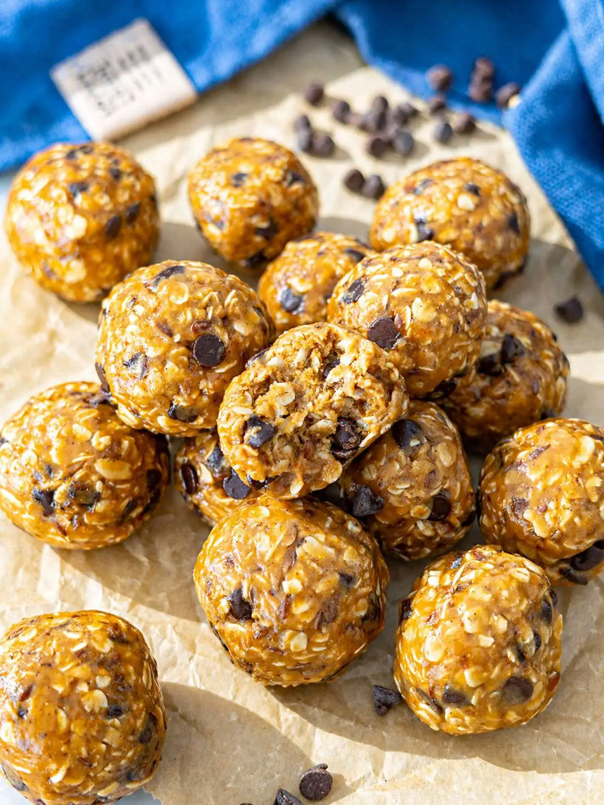

---
tags:
  - abc
---

## Ingredienti

| Ingredienti                  | Ingredienti             |
| ---------------------------- | ----------------------- |
| **100g** - Rolled oats | **130g** - creamy peanut butter |
| **85g** - Honey | **2 tblsp.** - ground flax seeds or chia seeds or almond flour |
| **45g** - mini chocolate chips or chopped chocolate | **1/2 teasp** - Vanilla extract |
| **1/4 teasp** - Cinnamon (Optional) | **1 pinch** - Salt |

## Procedimento

1. Mix the Wet Ingredients: add the creamy peanut butter, honey, and vanilla extract to a large bowl. Stir until the mixture is smooth, creamy, and fully combined.
2. Add the Dry Ingredients: add the oats, ground flax seeds, chocolate chips, cinnamon, and salt. Mix until a thick, sticky dough forms. It should resemble soft cookie dough and hold together when pressed.
3. Adjust and Roll: if the dough feels too soft, add a little more oats. If it feels too dry, add a bit more peanut butter. Lightly grease your hands with a few drops of then scoop and roll into small balls. You’ll get about 12 to 16 peanut butter protein balls, depending on size.
4. Chill and Enjoy: place the balls in the fridge until firm, or freeze them for 15 – 20 minutes for a firmer bite. These are perfect easy no bake snacks to keep on hand for busy days, workouts, or a quick energy boost anytime.

## Note

- Use natural peanut butter: go for 100% peanuts for the best flavor and a more wholesome snack. Avoid “no-stir” peanut butter, which often contains added oils and sugar.
- Stir your peanut butter well: natural peanut butter can separate—mix it thoroughly before using so your dough isn’t too oily or too dry. 
- Adjust texture as needed: if the mixture is too sticky, add oats; if too dry, add a bit more peanut butter or sweetener. 
- Grease your hands lightly: a few drops of olive oil on your palms makes rolling much easier and prevents sticking. 
- Chill before serving: refrigerating helps the balls firm up and improves texture. 
- Freeze for convenience: these energy balls freeze well and taste great straight from the freezer. Let them sit 5 to 10 minutes before eating. 
- Customize freely: add coconut flakes, chopped nuts, or protein powder to suit your taste and make them your go-to snack.

### Substitutions

- Rolled oats → Quick oats (softer texture), gluten-free oats
- Peanut butter → Almond butter, cashew butter, sunflower seed butter (nut-free)
- Honey → Maple syrup, agave, brown rice syrup, blended or finely chopped soft dates
- Ground flax seeds → Hemp seeds, chia seeds, oat flour, crushed nuts
- Mini chocolate chips → Chopped dark chocolate, cacao nibs, cranberries, raisins
- Vanilla extract → Almond extract, pinch of espresso powder
- Cinnamon (optional) → Pumpkin spice, or skip for neutral flavor
- Salt → Skip, or flaky sea salt on top for crunch

## Origine

[link]([https://](https://theplantbasedschool.com/peanut-butter-energy-balls/))

