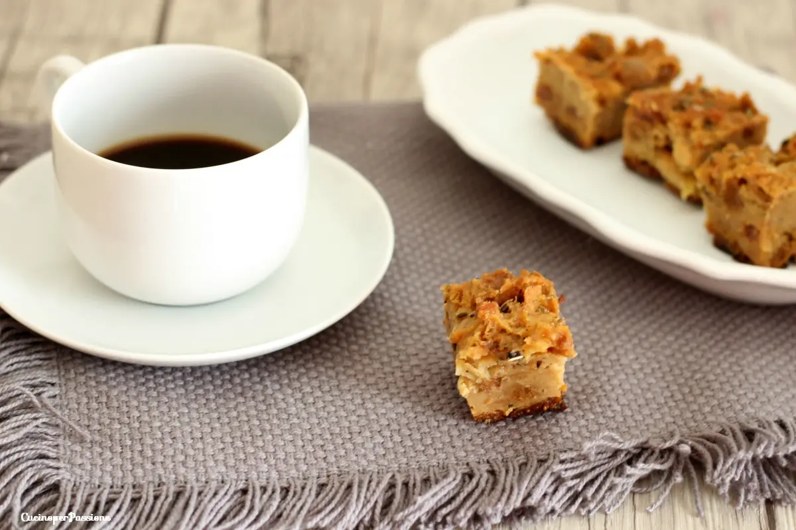

---
tags:
  - Dolce tradizionale
  - Veneto
  - Farina di mais
---
# Pinza

## Ingredienti

| Ingredienti | Ingredienti |
| --- | --- |
| **150 g** - Farina | **150 g** - Farina di mais fioretto |
| **1 bustina** - Lievito di birra secco | **75 g** - Uvetta |
| **30 g** - Pinoli | **30 g** - Semi di finocchio |
| **6** - Fichi secchi | **1 bicchierino** - Grappa |
| **125 g** - Zucchero | **1 pizzico** - Sale |
| Latte q.b. | |

## Procedimento

> Preriscaldare il forno a 180°

1. Mettere a bagno l'uvetta in acqua calda e tagliare i fichi secchi a piccoli pezzi. In una terrina versare le due farine, un pizzico di sale e lo zucchero.
2. Versare in una tazzina del latte, farlo intiepidire leggermente, versare il lievito e farlo sciogliere. Aggiungere alle farine la grappa, il latte con il lievito e mescolare bene fino a ottenere un impasto uniforme, aggiungere ulteriore latte se necessario.
3. Fare lievitare per alcune ore finché l'impasto raddoppia. Aggiungere l'uvetta ammollata e strizzata, i fichi tagliati a pezzi, i semi di finocchi e i pinoli.
4. Coprire con carta forno una teglia rettangolare abbastanza alta, versare il composto e livellarlo. Lasciar riposare mezz'ora.
5. Cuocere per 60 minuti. Controllare con la prova stecchino.
6. Servire freddo, preferibilmente il giorno dopo.

## Note

- Dolce rustico tradizionale veneto, consumato durante l'autunno, Natale e l'Epifania.

## Origine

[Pinza ricetta di un dolce veneto - Cucino per passione](https://blog.giallozafferano.it/cucinoperpassione/pinza-ricetta/)
