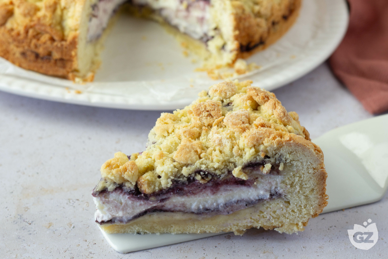

## Ingredienti

### Per la base (per uno stampo di 22 cm di diametro)

| Ingredienti                  | Ingredienti             |
| ---------------------------- | ----------------------- |
| **400 g** - Farina 00 | **150 g** - Zucchero |
| **120 g** - Burro | **2** - Uova |
| **8 g** - Lievito per dolci | Estratto di vaniglia |

### Per il ripieno

| Ingredienti                  | Ingredienti             |
| ---------------------------- | ----------------------- |
| **500 g** - Ricotta vaccina | **200 g** - Confettura di albicocca |
| **80 g** - Zucchero | Estratto di vaniglia |

## Procedimento

> Preriscaldare il forno a 180°

1. Come prima cosa lasciate scolare la ricotta in un colino a maglie strette per 30 minuti. 
2. Intanto dedicatevi alla preparazione della base. In una ciotola versate lo zucchero, aggiungete il burro e lavorate con un frullino per qualche minuto fino ad ottenere un composto farinoso. 
3. Aggiungete quindi le uova e l'estratto di vaniglia.
4. Lavorate il composto con la spatola, aggiungete poi la farina 00 e il lievito, precedentemente setacciati. 
5. Amalgamate prima con una spatola , poi con le mani fino ad ottenere delle grosse briciole e tenete da parte. 
6. Passate al ripieno: in una ciotola mettete lo zucchero, la ricotta e l'estratto di vaniglia, poi lavorate con la spatola, il risultato dovrà essere una crema omogenea.
7. Foderate con la carta forno uno stampo a cerniera di 22 cm di diametro, distribuite all'interno metà dell’impasto e compattatelo con le mani fino a ricoprire completamente la base dello stampo.
8. Ricoprite la base con metà della confettura lasciando libero un bordo di circa 1 cm, poi versate anche la crema di ricotta. 
9. Infine aggiungete delicatamente il resto della confettura sulla crema.
10. Ricoprite il tutto con l'impasto rimanente, arrivando fino al bordo esterno. 
11. Cuocete in forno statico a 180° per 45 minuti, fino a che la sbriciolata non sarà ben dorata. 
12. Fatela raffreddare completamente ed estraetela dallo stampo.

