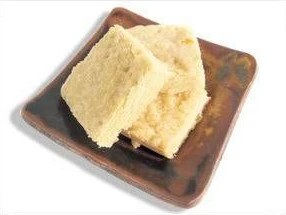

# "School Kine" shortbread cookies

## Ingredienti

| Ingredienti                  | Ingredienti             |
| ---------------------------- | ----------------------- |
| **220 g** - Butter, soft (2 sticks) | **317 g** - Sifted flour (2 $\frac{1}{3}$ cup) |
| **100 g** - Sugar ($\frac{1}{2}$ cup) | **A pinch** Salt |

## Procedimento

> Preriscaldare il forno a 150°

1. Grease a 9-inch baking pan or line with baking parchment.
1. Cream butter[^note]. Gradually add sugar and beat until light and fluffy.
1. Work in flour and salt with fingertips until well combined and crumbly. Press evenly into baking pan. Prick all over with fork.
1. Bake 50 to 60 minutes, until golden brown.
1. Cool slightly, then cut into bars.

[^note]: Montare con le fruste il burro morbido con lo zucchero.
