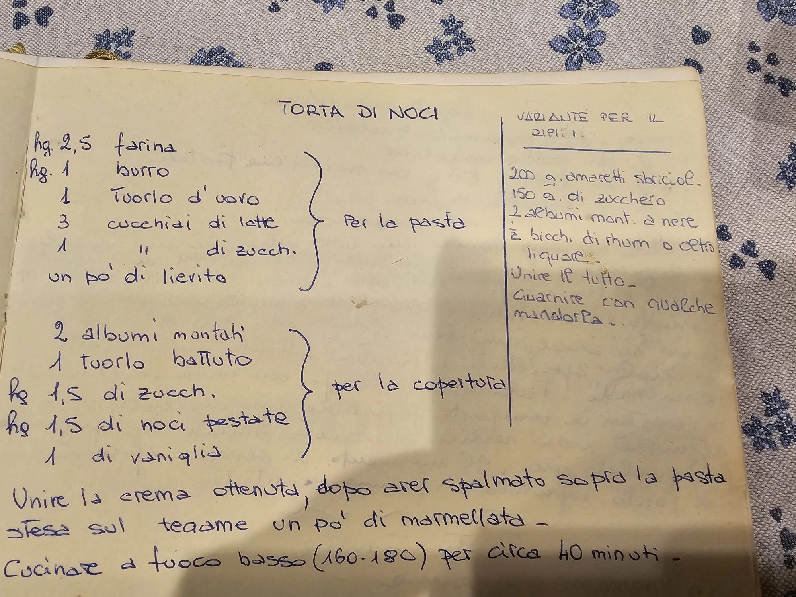

---
tags:
  - Noci
---

## Ingredienti

### Base

| Ingredienti                  | Ingredienti             |
| ---------------------------- | ----------------------- |
| **250 g** - Farina | **100 g** - Burro |
| **1** - Tuorlo | **3 cucchiai** - Latte |
| **1 cucchiaio** - Zucchero | Pizzico di lievito |

### Copertura

| Ingredienti                  | Ingredienti             |
| ---------------------------- | ----------------------- |
| **2** - Albumi | **1** - Tuorlo |
| **150 g** - Zucchero | **150 g** - Noci pestate |
| **1 baccello** - Vaniglia | Marmellata |

### Variante per la copertura

| Ingredienti                  | Ingredienti             |
| ---------------------------- | ----------------------- |
| **2** - Albumi | **1/2 bicchiere** - Rhum o altro liquore |
| **200 g** - Amaretti sbriciolati | **150 g** - Zucchero |
| Mandorle per decorare | |

## Procedimento

> Preriscaldare il forno a 160-180°

1. La base è lavorata come una crostata
2. Si montano i due albumi
3. Si sbatte il tuorlo.
4. Si dispone la base sulla teglia e si spalma di marmellata
5. Si versa la crema sopra la marmellata
6. Si inforna per circa 40 minuti

