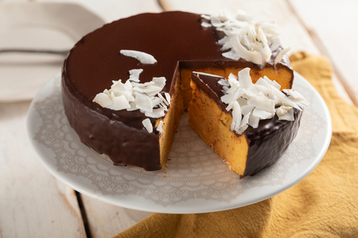

---
tags:
  - abc
---

## Ingredienti

### Per uno stampo a cerniera da 18 cm

| Ingredienti                  | Ingredienti             |
| ---------------------------- | ----------------------- |
| **300 g** - Carote | **100 g** - Farina di cocco |
| **150 g** - Farina di mandorle | **50 g** - Farina 00 |
| **150 g** - Zucchero | **3** - Uova |
| **180 g** - latte | **16 g** - Lievito in polvere per dolci |
| Sale | |

### Per la glassa

| Ingredienti                  | Ingredienti             |
| ---------------------------- | ----------------------- |
| **300 g** - Panna fresca liquida | **175 g** - Cioccolato fondente |

### Per decorare

| Ingredienti                  | Ingredienti             |
| ---------------------------- | ----------------------- |
| **30 g** - Scaglie di cocco | |

## Procedimento

> Preriscaldare il forno a 180°

1. Come prima cosa sgusciate le uova in una ciotola, quindi aggiungete lo zucchero e mescolate con una frusta. 
2. Una volta che lo zucchero si sarà sciolto, continuando a mescolare, aggiungete il latte.
3. Continuate con la farina di mandorle, la farina 00, la farina di cocco e il lievito per dolci. 
4. Amalgamate bene fino ad ottenere un composto omogeneo dalla consistenza rustica.
5. Pelate e grattugiate le carote, quindi unitele all’impasto. Mescolate nuovamente, aggiungete il sale e amalgamate un’ultima volta.
6. Trasferite l’impasto in uno stampo a cerniera da 18 cm di diametro, precedentemente imburrato e leggermente infarinato. Livellate la superficie e cuocete in forno statico a 180° per 40 minuti. 
7. Sfornate, estraete la torta dallo stampo e lasciate raffreddare.
8. Intano preparate la glassa al cioccolato: versate la panna in un pentolino e portate a bollore. 
9. Fuori dal fuoco aggiungete il cioccolato fondente e mescolate finché non si sarà sciolto completamente. 
10. Lasciate poi raffreddare fino alla temperatura di 40°.
11. Posizionate la torta su una gratella, versate la glassa al cioccolato sulla torta e distribuitela uniformemente con una spatola. 
12. Decorate a piacere con cocco fresco o scaglie di cocco.
13. Per gustarla al meglio, lasciate riposare la torta in frigorifero per almeno un'ora.

## Note

- Durante la cottura della torta, potete mettere un pentolino di acqua calda sul fondo del forno, in questo modo si creerà una leggera umidità che non farà seccare troppo la torta.
- Se desiderate potete arricchire l'impasto con della frutta secca come mandorle tritate, noci pecan o nocciole per dare una nota croccante.
- Se preferite un gusto più delicato, potete sostituire il cioccolato fondente con del cioccolato bianco.