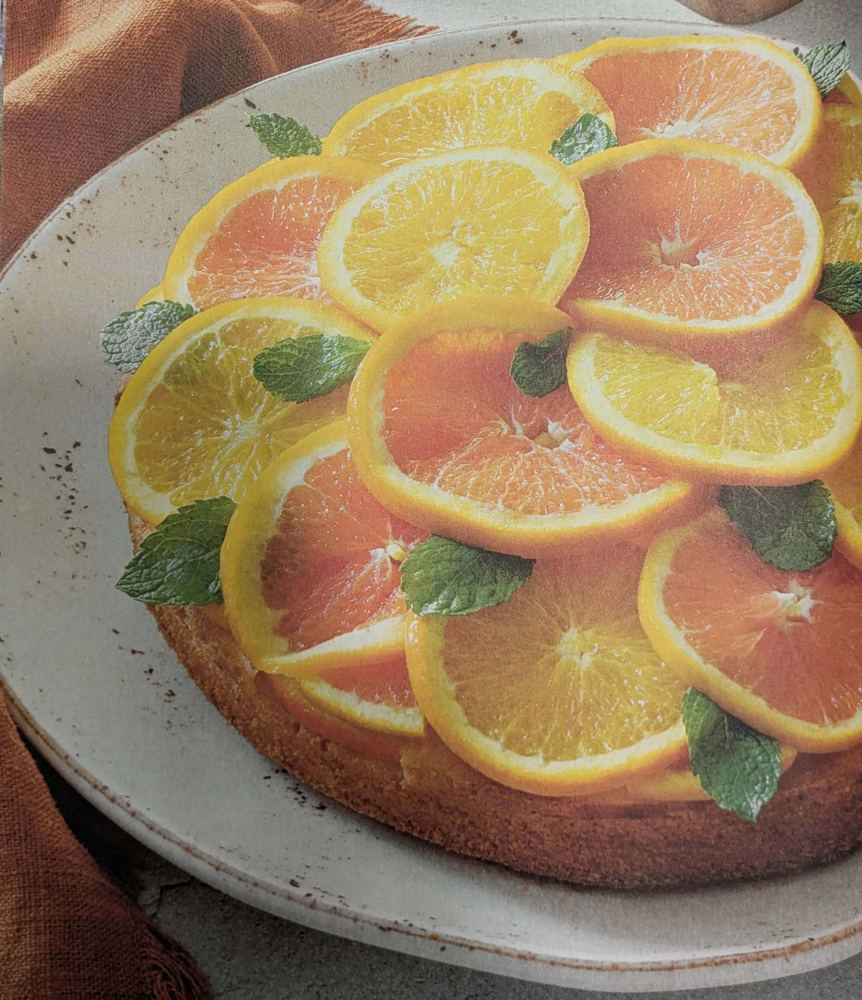

## Ingredienti

| Ingredienti                  | Ingredienti             |
| ---------------------------- | ----------------------- |
| **30 g** - Burro fuso | **200 + 120 g** - Zucchero |
| **4** - Arance medie | **3** - Uova |
| **120 ml** - Succo d'arancia | Scorza grattugiata di 3 arance |
| Estratto di vaniglia | sale |
| **70 g** - Olio di semi | **220 g** - Farina 00 |
| **8 g** - Lievito per dolci | **200 g** - Acqua |
| Fogli di menta | |

## Procedimento

> Preriscaldare il forno a 180°

1. Preparare uno stampo da 24 cm di diametro foderando la base con carta forno e imburrando e infarinando i bordi. 
2. Versare sul fondo il burro fuso e cospargere con dello zucchero semolato. 
3. Tagliare le arance a fettine sottili e disporle sul fondo dello stampo, partendo dal centro e sovrapponendole leggermente fino a coprire tutta la superficie.
4. Riempire gli spazi vuoti con fettine più piccole per ottenere un effetto uniforme. 
5. In una ciotola montare le uova con lo zucchero fino a ottenere un composto chiaro e spumoso. 
6. Aggiungere il succo d'arancia, la scorza grattugiata delle arance, l'estratto di vaniglia, un pizzico di sale e l'olio di semi, amalgamando delicatamente.
7. Setacciare la farina con il lievito e incorporarla poco alla volta al composto, mescolando dal basso verso l'alto con una spatola per non smontare l'impasto. 
8. Versare il composto nello stampo sopra le fettine di arancia e livellare. 
9. Cuocere in forno statico preriscaldato a 180°C per circa 40 minuti, verificando la cottura con uno stecchino.
10. Una volta pronta, lasciar raffreddare la torta nello stampo, quindi capovolgerla su un piatto da portata. Proseguire la ricetta preparando le arance glassate.
11. Mettere i 120 g di zucchero rimasto in una padella, aggiungere delle fette di arancia sottili e l'acqua. 
12. Cuocetele per circa 5 minuti fino a glassatura. 
13. Disponetele sulla torta con qualche foglia di menta fresca.

