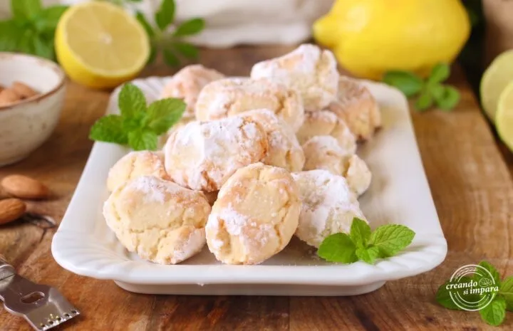

## Ingredienti

| Ingredienti                  | Ingredienti             |
| ---------------------------- | ----------------------- |
| **30 g** - Albume | **75 g** - Farina di mandorle |
| **60 g** - Zucchero | **1 pizzico** - Sale |
| Scorza di limone grattugiata | Zucchero a velo |

## Procedimento

> Preriscaldare il forno a 180°

1. Mescola gli albumi con lo zucchero: Versa gli albumi in una ciotola capiente. Unisci lo zucchero semolato e mescola brevemente con un cucchiaio o una spatola fino ad amalgamare i due ingredienti, senza bisogno di montare a neve.
1. Incorpora la farina di mandorle e gli aromi: Aggiungi al composto il pizzico di sale, la scorza di limone grattugiata e la farina di mandorle. Mescola con cura tutti gli ingredienti fino a ottenere un impasto omogeneo e leggermente apiccicoso. 
1. Copri la ciotola con pellicola trasparente e lascia riposare l’impasto a temperatura ambiente per 30 minuti: questo passaggio permetterà alla farina di mandorle di idratarsi e compattarsi al punto giusto.
1. Forma e pizzica i biscotti: Trascorso il tempo di riposo, prepara un piatto fondo con abbondante zucchero a velo. 
1. Preleva una noce di impasto (il composto risulterà morbido), forma una pallina con le mani e ponila direttamente nello zucchero a velo, facendola rotolare bene su tutti i lati per ricoprirla completamente. 
1. Disponi le palline sulla leccarda rivestita di carta forno e, utilizzando tre dita (pollice, indice e medio), pizzica la parte superiore di ciascun biscotto per conferirgli la classica forma a cupoletta increspata.
1. Inforna la leccarda in forno statico già caldo a 180°C per circa 15 minuti. I biscotti dovranno rimanere chiari in superficie e creare sottili crepe nello zucchero a velo. Sforna i pizzicotti alle mandorle e limone e lasciali raffreddare completamente sulla teglia prima di toccarli, poiché da caldi saranno molto delicati.

# Note

- Non cuocere troppo: i pizzicotti devono uscire dal forno ancora morbidi al tatto; asciugandosi durante il raffreddamento raggiungeranno la consistenza ideale.
- Riposo fondamentale: non saltare i 30 minuti di riposo dell’impasto, altrimenti le palline tenderanno ad allargarsi troppo in cottura perdendo la forma pizzicata.
- Zucchero a velo generoso: abbonda nella copertura prima di pizzicarli per ottenere il bellissimo contrasto visivo tra lo zucchero bianco e le crepe dorate.
- **Varianti**:
    - Versione all’Arancia: sostituisci la scorza di limone con scorza di arancia biologica o mandarino per una nota agrumata più calda.
    - Pizzicotti al Pistacchio: puoi sostituire metà della farina di mandorle con farina di pistacchio non salato per pasticcini bicolore.
