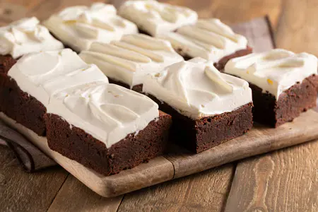

---
tags:
  - abc
---

## Ingredienti

### Torta

| Ingredienti                  | Ingredienti             |
| ---------------------------- | ----------------------- |
| **230 g** - Cioccolato fondente al 55% | **220 g** - Burro |
| **4** - Uovo | **140 g** - Farina 00 |
| **20 g** - Cacao amaro in polvere | **5 g** - Lievito in polvere per dolci |
| **220 g** - Burro | **1 pizzico** - Sale fino |

### Crema al latte

| Ingredienti                  | Ingredienti             |
| ---------------------------- | ----------------------- |
| **250 g** - Panna fresca liquida | **150 g** - Mascarpone |
| **80 g** - Latte condensato | **20 g** - Miele millefiori |

## Procedimento

### Torta

> Preriscaldare il forno a 180°

1. Iniziate versando il cioccolato tritato in una ciotola per la cottura a bagnomaria. 
2. Unite il burro a pezzetti e un pizzico di sale. 
3. Mescolate di tanto in tanto fino a completo scioglimento, poi lasciate intiepidire.
4. Versate le uova in una ciotola con lo zucchero, poi montate con le fruste elettriche fino ad ottenere un composto chiaro e spumoso. 
5. A questo punto incorporate il cioccolato fondente intiepidito.
6. Montate ancora con le fruste elettriche per ottenere un impasto omogeneo. 
7. Setacciate all'interno la farina.
8. Proseguite con il cacao e il lievito e amalgamate ancora con le fruste elettriche.
9. Quando anche le polveri saranno ben incorporate, ungete e foderate con carta forno una teglia da 25x25 cm, versate l’impasto all'interno e distribuitelo uniformemente con la spatola. 
10. Cuocete in forno statico preriscaldato a 180° per circa 30-35 minuti, nel ripiano centrale.
11. Sfornate il brownie e lasciate intiepidire. 

### Crema

1. In una ciotola versate il mascarpone, il miele e la panna.
2. Iniziate a montare con le fruste elettriche, poi versate anche il latte condensato. 
3. Mescolate delicatamente con una spatola per incorporarlo e tenete da parte.
4. Una volta raffreddato, sformate il dolce su un tagliere, poi ricoprite la superficie con la crema sulla superficie creando un effetto spatolato con il dorso di un cucchiaio. 
5. Riponete in frigorifero a raffreddare per almeno 2 ore, poi potete tagliare il dolce in cubi

## Note

Se la crema dovesse risultare troppo consistente potete ammorbidirla aggiungendo 2-3 cucchiai di latte.