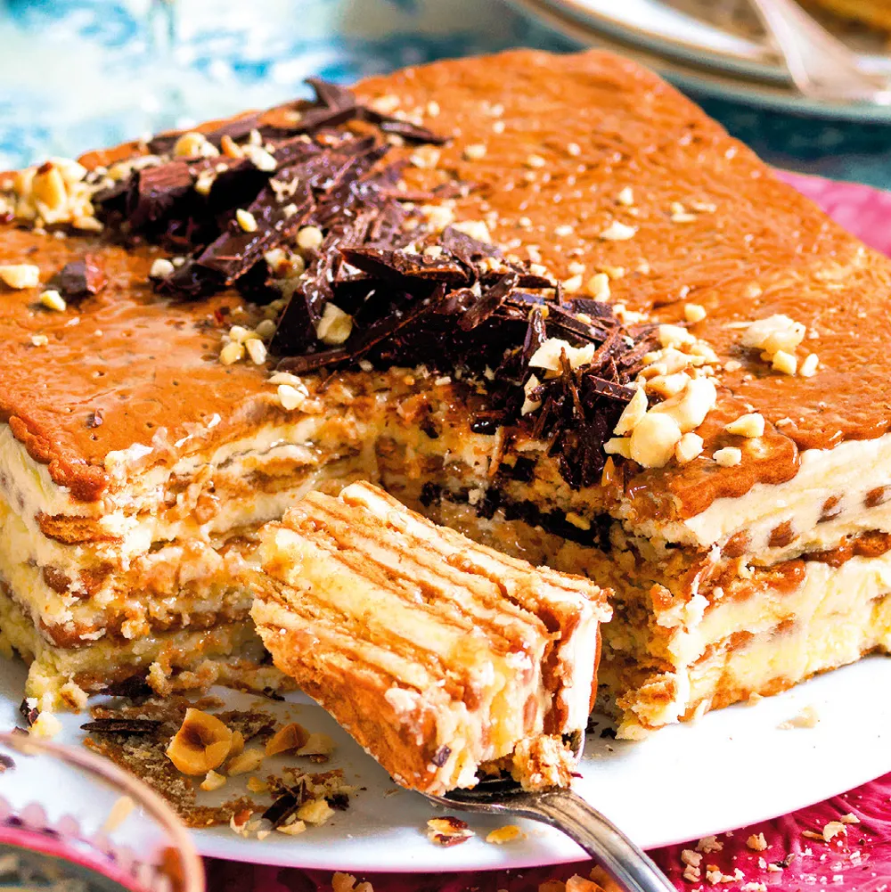

---
tags:
  - Biscotti secchi
  - Caffè
---

## Ingredienti

| Ingredienti                  | Ingredienti             |
| ---------------------------- | ----------------------- |
| **400 g** - Biscotti secchi | **250 g** - Burro |
| **200 g** - Zucchero | **75 g** - Marsala |
| **4 tazzine** - Caffè freddo | **3** - Tuorli |
| Nocciole | Cioccolato |

## Procedimento

1. Per la ricetta della crema al burro e biscotti secchi, lavorate burro e zucchero con una frusta finché non otterrete una crema liscia e omogenea.
2. Unite i tuorli e il Marsala, sempre mescolando.
3. Intingete i biscotti nel caffè e fate un primo strato in uno stampo quadrato (lato 16 cm, h 4 cm). 
4. Montate una mattonella alternando crema e biscotti, finendo con i biscotti.
5. Fate riposare in frigo per 2-3 ore. 
6. Toglietela dal frigo 15 minuti prima di servire e decorate con nocciole e cioccolato tritati.
