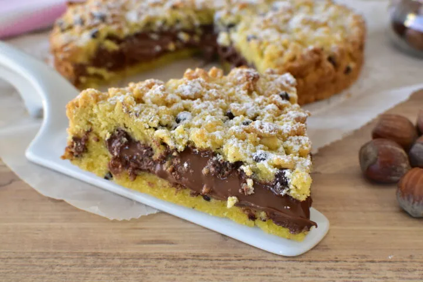

---
tags:
  - Nutella
---

## Ingredienti

| Ingredienti                  | Ingredienti             |
| ---------------------------- | ----------------------- |
| **300 g** - Farina 00 | **120 g** - Zucchero |
| **120 g** - Burro freddo | **1** - Uovo |
| **1** - Tuorlo | **1 cucchiaino** - Lievito in polvere per dolci |
| **250 g** - Nutella | |

## Procedimento

> Preriscaldare il forno a 180°C

1. In una ciotola capiente, mescola la farina con il lievito e lo zucchero. 
2. Aggiungi il burro freddo a pezzetti e lavora velocemente con la punta delle dita fino a ottenere un composto sabbioso.
3. Unisci l’uovo intero e il tuorlo, continuando a mescolare fino a ottenere un impasto sbriciolato e non compatto.
4. Prendi metà del composto e distribuiscilo sul fondo di una teglia da 22-24 cm di diametro, pressandolo leggermente.
5. Spalma uniformemente la Nutella sulla base, lasciando circa 1 cm dal bordo per evitare che fuoriesca in cottura.
6. Distribuisci il restante impasto sbriciolato sopra la Nutella, senza compattarlo troppo.
7. Inforna la crostata sbriciolata in forno statico preriscaldato a 180°C per circa 30-35 minuti, finché la superficie risulterà dorata.
8. Una volta sfornata, lascia raffreddare completamente prima di servire per consentire alla Nutella di stabilizzarsi.

## Note

- **Burro freddo**: per ottenere un impasto sabbioso, il burro deve essere ben freddo di frigorifero.
- **Riposo in frigo**: se hai tempo, lascia riposare l’impasto in frigo per 30 minuti prima di usarlo; questo aiuterà a ottenere una consistenza più croccante.
- **Strato uniforme di Nutella**: per facilitarne la stesura, ammorbidisci leggermente la Nutella scaldandola a bagnomaria o nel microonde per pochi secondi.
- **Non compattare troppo la copertura**: per un effetto più croccante e sbriciolato, evita di premere eccessivamente l’impasto superiore.