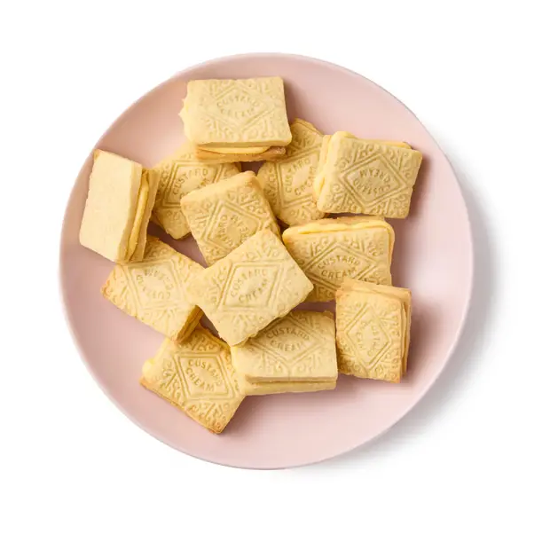

---
tags:
  - Custard
---

## Ingredienti

### For the biscuits

| Ingredienti                  | Ingredienti             |
| ---------------------------- | ----------------------- |
| **100g** - Butter at room temperature | **85g** - Caster sugar |
| **1** - Egg, beaten | **1/2 tsp** - Vanilla extract |
| **210g** - Plain flour | **1 pinch** - Salt |

### For the filling

| Ingredienti                  | Ingredienti             |
| ---------------------------- | ----------------------- |
| **50g** - Butter at room temperature | **85g** - Icing sugar |
| **25g** - Custard powder | **1 pinch** - Salt |
| Warm milk | |

## Procedimento

> Preheat the oven to 180C

1. Dice the butter and put it in a food mixer. Beat briefly to soften, then add the caster sugar and beat until creamy and lightened in colour; 
2. scrape down the sides of the bowl a couple of times, to make sure everything’s evenly mixed. (Alternatively, use a large bowl and electric beaters.)
3. Whisk the egg and vanilla, then, still beating, gradually add this to the butter mixture. 
4. Once that’s incorporated, sift in the flour and salt, then mix to a firm dough – it’s easiest to use your hands for this.
5. Cut out a sheet of baking paper to line a baking tray, then put this on a work surface and lightly sprinkle with flour.
6. Roll out the dough to about 3mm thick, then lay it on the paper-topped baking sheet and pop it in the freezer for 15 minutes (or chill in the fridge for 30 minutes).
7. Use cutters to cut out the biscuits to your desired shape (if using a stamp, flour it lightly first to make it more effective), then arrange on baking paper-lined trays and return to the freezer (or fridge) while you heat the oven to 180C.
8. Bake for about 14 minutes, until just beginning to turn golden around the edges, then remove and leave to cool completely.

1. For the filling, beat the butter in a food mixer or with electric beaters to soften it, then sift in the icing sugar and custard powder, and beat again to incorporate.
2. Add a pinch of salt, plus about two teaspoons of milk or water as required to make it spreadable, then beat again until fluffy and light.
3. Spread the icing over the non-patterned sides of half the biscuits, then sandwich with the remaining biscuits. Keep in an air-tight container.

## Note

**The rolling and shaping**: The way you treat the dough is almost as important as what you put in it – rolling it out to Leith’s 3mm, rather than the more usual 4mm, will give a thinner, crisper finish, while Lamb’s advice to freeze it briefly before cutting helps the biscuits keep their form in the oven. She pipes hers into clamshells, Lawson, whose recipe is nominally intended for Valentine’s day, suggests a heart theme (a cutter that, I confess, I can’t immediately lay my hands on, so I hope she won’t object to my dog-shaped substitution). Meanwhile, Ysewijn recommends rectangles and pushing a “piece of lace or something similar” into the dough to achieve the requisite “baroque pattern” and Niven simply rolls hers into small balls. All are perfectly acceptable options, but if you’re dead set on making custard creams, you might also like to invest in a special stamp to make them look the part – they’re not expensive, and the results are very pleasing.

## Origine

[link](https://www.theguardian.com/food/2026/apr/26/how-to-make-the-perfect-custard-creams-recipe-felicity-cloake)

