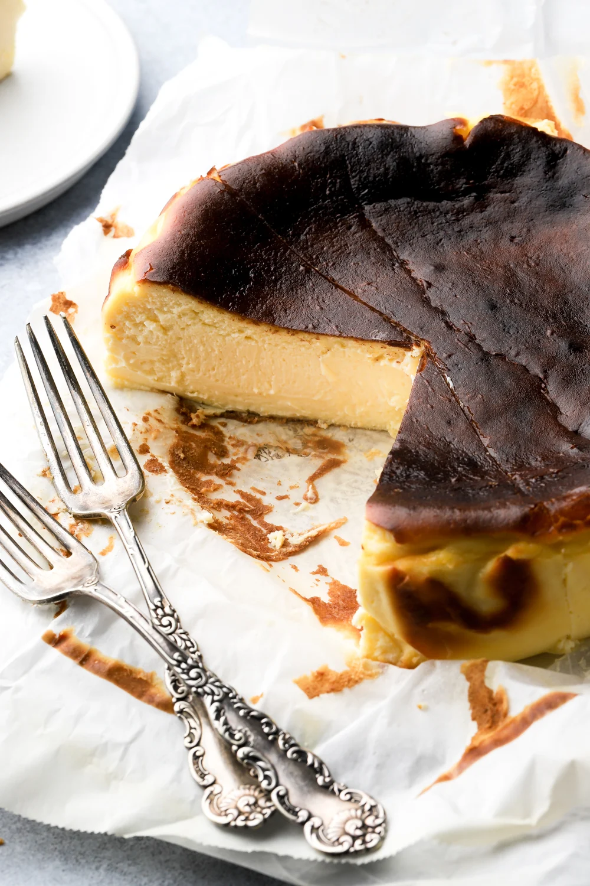

---
tags:
  - Philadelphia
---

## Ingredienti

| Ingredienti                  | Ingredienti             |
| ---------------------------- | ----------------------- |
| **24 oz.** - Cream cheese at room temperature (**680 g**) | **1 cup** - Granulated sugar (**200 g**) |
| **1 Tbsp** - Cornstarch (**20 g**) | **$\frac{1}{2}$ tsp** - Salt |
| **2 tsp** - Vanilla extract | **4** - Large eggs at room temperature |
| **$1\frac{1}{2}$ cups** - Heavy whipping cream at room temperature (**350 g**) | |

## Procedimento

> Preheat the oven to 200 °C

1. Line a round 8x3” baking pan with two large sheets of parchment paper so there's an overhang. Secure it with metal binder clips.
2. Place the room temperature cream cheese, sugar, cornstarch, salt and vanilla in the bowl of a stand mixer (or a large bowl with a hand mixer) and use the paddle attachment at low speed to beat the mixture until it’s smooth and has no more chunks of cream cheese. This should take 2-4 minutes. Make sure to scrape the bottom and edge of the bowl to get it all mixed well.
3. Keep the mixer running at low speed and add the eggs, one at a time allowing each one to incorporate before adding the next, about 30-60 seconds between each egg.
4. Scrape the bottom and edge of the bowl again and then with the mixer on low speed, stream in the heavy whipping cream, mixing until it’s fully incorporated and all the batter is smooth.
5. Pour the mixture through a large sieve into the prepared pan. This removes any chunks or air bubbles that were incorporated.
6. Tap the pan on the counter a few times and bake for 45 minutes. 
7. The cheesecake should be a light to medium brown color on top, puffed and set around the edges and jiggly in the center. If you want it more browned on top like mine, set the oven to broil for the last 1-2 minutes of baking.
8. Allow the cheesecake to cool in the pan for at least 2 hours at room temperature and then refrigerate for another 4-6 hours, or overnight before serving.
