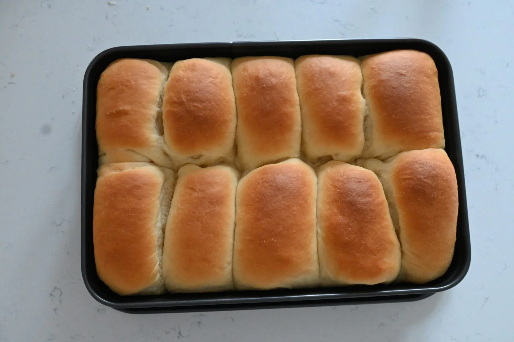

---
tags:
  - Nutella
---
# Cofanetti Brioche alla Nutella

## Ingredienti

| Ingredienti                  | Ingredienti             |
| ---------------------------- | ----------------------- |
| **200 g** - Latte a temperatura ambiente | **20 g** - Lievito di birra fresco |
| **300 g** - Farina 00 | **60 g** - Zucchero a velo |
| **200 g** - Farina Manitoba | **3** - Tuorli |
| **150 g** - Zucchero | Nutella |

## Procedimento

> Preriscaldare il forno a 170°

1. Mettiamo il lievito di birra nel latte e sciogliamo tutto bene mescolando con un cucchiaio.
2. In un’altra ciotola mettiamo le farine e lo zucchero, mescoliamo tutto insieme.
3. Uniamo il burro e cominciamo ad impastare tutto.
4. Aggiungiamo man mano il latte, sempre impastando ed i tuorli.
5. Lavoriamo l’impasto a mano per 2-3 minuti fino ad ottenere un composto liscio ed omogeneo.
6. Copriamo la ciotola con pellicola trasparente e lasciamo lievitare per 2-3 ore fino al raddoppio.
7. Prendiamo l’impasto e sistemiamolo sul piano da lavoro. Cerchiamo di non manipolarlo troppo altrimenti l’aria fuoriuscirà tutta. Dividiamolo in panetti da 70 g.
8. Prendiamo i panetti, schiacciamoli delicatamente ed arrotoliamoli su loro stessi. Dobbiamo ottenere dei piccoli cofanetti compatti. Sistemiamoli all’interno di una teglia antiaderente rettangolare leggermente distanziati tra loro. In questo modo si svilupperanno in altezza.
9. Copriamoli con pellicola trasparente e lasciamoli lievitare per 30 minuti.
10. Una volta pronti spolveriamoli con zucchero a velo ( così avranno una superficie dorata e leggermente croccante ).
11. Inforniamoli a 180° statico o 170° ventilato per 20 minuti.
12. Una volta pronti sforniamoli e lasciamoli raffreddare completamente poi farciamoli con nutella

## Note

- Il burro deve essere morbido e non completamente sciolto quindi toglietelo dal frigo almeno un’ora prima.
- Sia il latte che i tuorli meglio se sono a temperatura ambiente e con gli albumi potete fare a limite una frittata di albumi.
- Varianti: Potete aggiungere all’impasto delle gocce di cioccolato oppure dell’uvetta.

---

