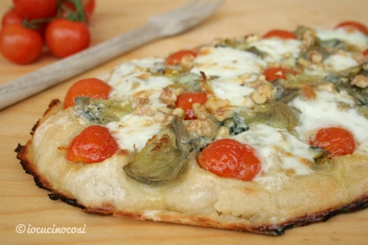
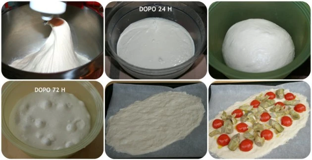

---
tags:
  - Farina di riso
  - Farina di soia
---
# Pinsa romana

## Ingredienti

| Ingredienti                  | Ingredienti             |
| ---------------------------- | ----------------------- |
| **650 g** - farina di frumento 350/400W | **3 g** - Lievito madre essiccato |
| **30 g** - farina di riso| **10 g** - Sale |
| **20 g** - farina di soia| **10 g** - Olio evo |
| **500 ml** - acqua | |

## Procedimento

> Scaldate il forno a 250° in modalità statica.

1. Mescolate le farine ed il lievito secco e versatele nella planetaria con il gancio.
1. Versate l’80% dell’acqua (400 ml) ed impastate a velocità 1 per un minuto. Poi passate a velocità 2 per 8 minuti.
1. Aggiungete il sale e continuate ad impastare per 3 min.
1. Versate l’olio ed impastate per altri 2 min.
1. Infine versate l’acqua restante impastando per altri 5 minuti. Impastate in totale circa 20 minuti.
1. Lasciate riposare l’impasto nella ciotola della planetaria per 30 minuti, durante i quali effettuate una ventilazione ogni 10 min. La ventilazione consiste nell’alternare dei tempi di riposo a brevi impasti della pasta con pochi giri di impastatrice, allo scopo di aumentare l’assorbimento dell’acqua ed ottenere una maggiore consistenza. Gli impasti molto idratati, infatti, che inizialmente risultano appiccicosi, dopo la ventilazione sono più compatti e incordati.
1. Quindi, ad impasto pronto e fermo nell’impastatrice, date 3 o 4 giri di gancio ogni 10 minuti di pausa.
1. Dopo la ventilazione l’impasto risulterà perfettamente incordato (sarà compatto, asciutto e rimarrà attaccato al gancio), quindi formate un panetto e riponetelo in un contenitore in frigorifero, da un minimo di 24 ad un massimo di 150 ore.
1. Trascorse 24 ore, stagliate i panetti (da 250 g o da 500 g) e riponeteli di nuovo in frigorifero per migliorare la lievitazione oppure utilizzateli dopo qualche ora per preparare le pinse farcendoli come preferite. Stendete l’impasto all’altezza che preferite, più spesso se volete una pinsa più tipo focaccia oppure più basso se la preferite sottile.
2. Distribuite sulle pinse la passata di pomodoro (potete anche condirla con olio, sale e origano o metterla scondita), irrorate con un filo d’olio d’oliva e quando il forno avrà raggiunto la giusta temperatura mettete le teglie nella parte bassa del forno direttamente a contatto col fondo. Questo farà in modo che la base della pinsa diventi croccante e che il calore diretto faccia gonfiare bene la pinsa, che risulterà quindi soffice ed alveolata. A metà cottura, dopo circa 10 minuti, tirate fuori le pinse, distribuite anche la mozzarella a cubetti, qualche foglia di basilico e gli altri ingredienti che preferite e rimettete in forno non più sul fondo ma al primo livello e completate la cottura.
3. Cuocete complessivamente per 25/30 minuti, controllate il grado di cottura verificando che sia uniforme, quindi togliete dal forno e servite la pinsa ben calda.

