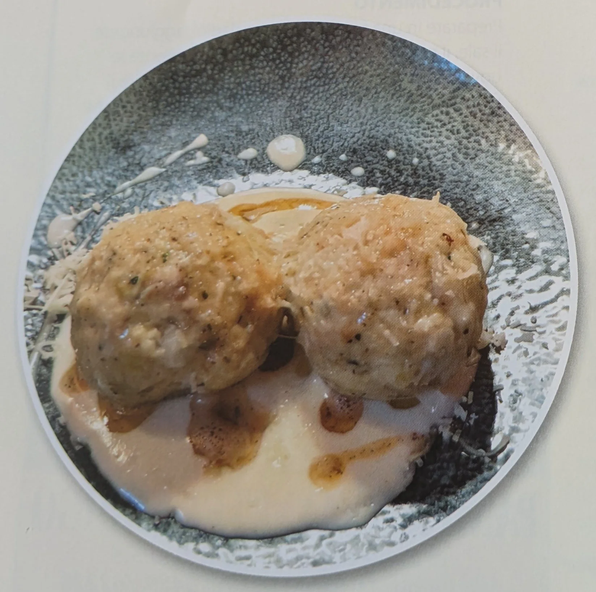

## Ingredienti

### Canederli

| Ingredienti                  | Ingredienti             |
| ---------------------------- | ----------------------- |
| **500 g** - Pane | **250 g** - Porri |
| **250 g** - Fresco Primiero | **200 ml** - Latte |
| **2** - Uova | **100 g** - Trentingrana |
| **10 g** - Prezzemolo tritato | Sale |
| Pepe | |

### Salsa 

| Ingredienti                  | Ingredienti             |
| ---------------------------- | ----------------------- |
| **200 g** - Panna da cucina | **150 g** - Trentingrana |

## Procedimento

1. Prendere il pane, tagliarlo a dadini e aggiungere il latte. 
2. Mentre aspettiamo che il latte si assorba bene mettiamo a brasare i porri, anch'essi tagliati a piccoli pezzi. 
3. Una volta assorbito bene aggiungiamo tutti gli altri ingredienti e impastiamo bene il tutto. 
4. Formiamo dei Canederli di circa 100 g l'uno. 
5. Mettiamo a cuocere in acqua bollente salata per 10 minuti.
6. Mentre i nostri Canederli sono in cottura prepariamo la salsa mettendo a scaldare la panna con il Trentingrana. 
7. Una volta cotti mettiamo la salsa nel piatto e adagiamo sopra i nostri Canederli finendo con un po di burro fuso.

## Note

Il Fresco Primiero è un formaggio semi cotto, morbido, in forma.