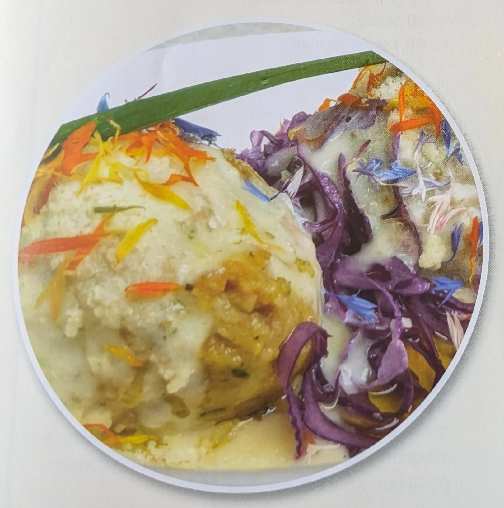

---
tags:
  - Rape rosse
  - Birra
---

## Ingredienti

| Ingredienti                  | Ingredienti             |
| ---------------------------- | ----------------------- |
| **500 g** - Pane raffermo a dadini | **300 g** - Rape sbollentate e tritate |
| **33 cl** - Birra rauca e Altavienna | **1** - Porro (Julienne) |
| **2/3 cucchiai** - Farina | **3** - Uova |
| Sale | Prezzemolo tritato |
| Olio evo | **1 foglia** Alloro |

## Procedimento

1. Preparare in una terrina il pane a dadini, aggiungere il sale, il prezzemolo, la birra e successivamente le uova, mescolando con un cucchiaio.
2. Imbiondire il porro con l'olio e la foglia di alloro e versarlo assieme alle rape sopra il pane, impastare bene il tutto. 
3. Con le mani bagnate formare i canederli e bollirli in brodo leggero per 15 min circa. 
4. Condire a piacimento.

## Note

La birra rauca è una birra rauch, quindi affumicata. L'Alta Vienna è del birrificio BioNoc' ed in questo caso il sapore affumicato non è molto intenso