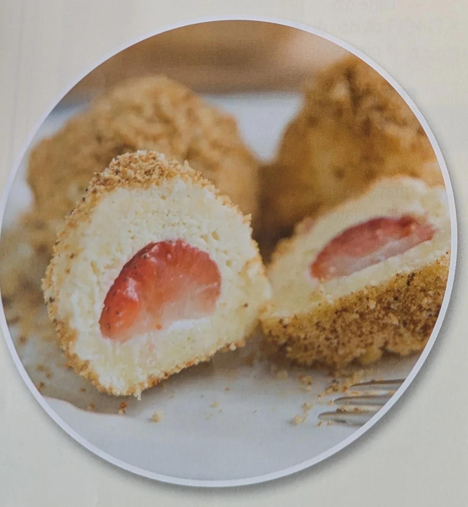

---
tags:
  - abc
---

## Ingredienti

| Ingredienti                  | Ingredienti             |
| ---------------------------- | ----------------------- |
| **250 g** - Ricotta | **100 g** - Farina |
| **50 g** - Semolino | **1** - Uovo |
| **2 cucchiai** - Zucchero | Sale |
| **12** - Fragole fresche | **50 g** - Burro |
| Pangrattato | Zucchero a velo |

## Procedimento

1. Per preparare questi squisiti canederli, per prima cosa in una ciotola mescola la ricotta, la farina, il semolino, l'uovo, lo zucchero e un pizzico di sale fino a ottenere un impasto liscio e omogeneo. 
2. Una volta pronto, lascia riposare l'impasto per circa 30 minuti. 
3. Nel frattempo, lava le fragole e rimuovi le foglie. 
4. Trascorso il tempo di riposo, dividi l'impasto in 12 porzioni e, con delicatezza, modella ogni porzione attorno a una fragola, ricoprendola interamente. 
5. Porta a ebollizione una grande pentola d'acqua salata. Quando bolle, immergi i canederli e lasciali cuocere per circa 10 minuti, finché non saliranno a galla. 
6. Mentre i canederli cuociono, in una padella sciogli il burro e tostaci il pangrattato fino a che non diventerà dorato e fragrante. 
7. Scola i canederli dall'acqua e falli rotolare subito nel pangrattato tostato, assicurandoti che siano ben ricoperti. 
8. Servi i canederli caldi, spolverandoli con abbondante zucchero a velo.

