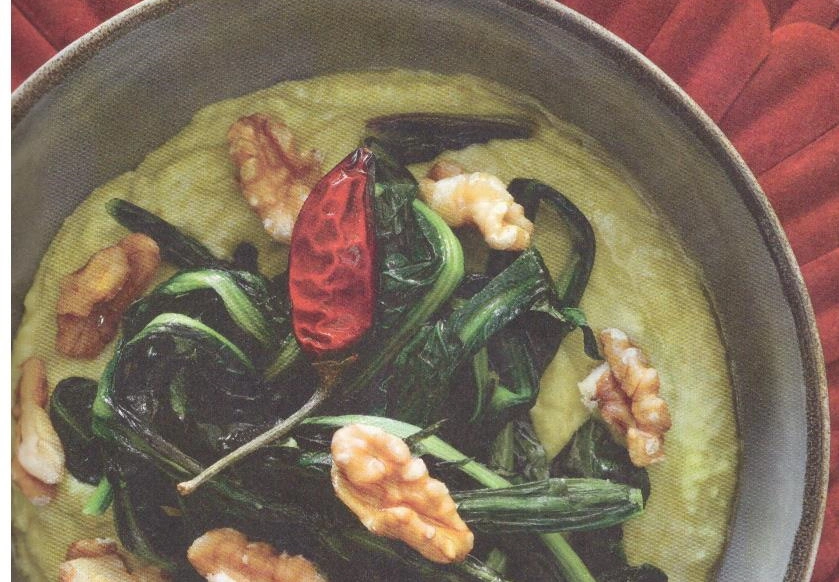

---
tags:
  - Fave
  - Cicoria
  - Noci
---
# Crema di fave, cicoria e noci

## Ingredienti

| Ingredienti                  | Ingredienti             |
| ---------------------------- | ----------------------- |
| **300 g** - Fave secche | Olio evo |
| **2 cespi** - Cicoria | Sale e pepe |
| Aglio | **80 g** - Noci |
| Peperoncino |  |

## Procedimento

1. Mettere le fave secche a bagno la sera prima e tenerle in acqua tutta la notte, o comunque per 12 ore. 
1. Il giorno dopo togliere le fave dall'acqua e metterle in una casseruola un pò alta, con brodo vegetale o acqua calda fino a coprirle. Portare a cottura finché non diventano tenerissime: devono diventare purea premendole con un cucchiaio di legno. Aggiustare di sale e pepe. 
1. Pulire la cicoria e togliere la costa più dura. Sbollentarla in acqua bollente salata per 3 minuti, scolarla, strizzarla bene e passarla in padella con aglio e peperoncino. 
1. Frullare le fave o schiacciarle con una forchetta. Metterle in una ciotola, coprire con la cicoria, un pizzico di peperoncino e guarnire con noci sbriciolate
