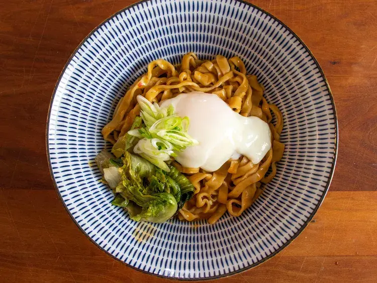

---
tags:
  - Ramen
  - Fagioli
  - Miso
  - Giapponese
  - Vegetariano
---
# Double Bean Mazemen

## Ingredienti

| Ingredienti | Ingredienti |
| --- | --- |
| **240 ml** - Liquido di cottura dei fagioli (o brodo vegetale/pollo a basso contenuto di sodio) | **65 g** - Fagioli cotti (o in scatola, scolati) |
| **60 ml** - Pasta di fagioli fermentata (doubanjiang, miso, doenjang o gochujang) | **60 ml** - Olio di sesamo o altro olio aromatico |
| **20 ml** - Aceto di riso | Sale kosher q.b. |
| **4 porzioni** - Noodles ramen (freschi o secchi) | Cipollotti affettati per servire |
| **4** - Uova onsen per servire (opzionale) | |

## Procedimento

1. Portare a bollore una grande pentola d'acqua.
2. Nel frattempo, combinare il liquido di cottura dei fagioli e i fagioli in un contenitore adatto al microonde e scaldare alla massima potenza fino a che fumano, 1-2 minuti. In alternativa, combinare in un pentolino a fuoco medio-alto e cuocere per 3-4 minuti.
3. Trasferire il composto caldo nel frullatore. Aggiungere la pasta di fagioli fermentata, l'olio e l'aceto di riso, e frullare fino ad ottenere un composto liscio, circa 1 minuto. Aggiustare di sale, versare 120 ml di salsa in una ciotola grande e mettere da parte la salsa rimanente.
4. Aggiungere una porzione di noodles all'acqua bollente e cuocere secondo le istruzioni della confezione.
5. Scolare brevemente i noodles e aggiungerli alla ciotola con la salsa. Con pinze o bacchette, mescolare vigorosamente i noodles nella salsa fino a quando sono ben ricoperti, circa 30 secondi. Aggiustare di sale e aceto a piacere.
6. Trasferire i noodles conditi in una ciotola individuale, raccogliendo la salsa rimasta con una spatola. Guarnire con cipollotti e uovo onsen (se si desidera). Servire immediatamente.
7. Ripetere i passaggi 4-6 con le porzioni rimanenti di noodles e salsa (120 ml per porzione), pulendo la ciotola tra una porzione e l'altra.

## Note

- Il piatto viene meglio con fagioli cotti da secchi. Se si usano fagioli in scatola, usare quelli a basso contenuto di sodio e sostituire il liquido della scatola con brodo.
- Funziona con molti tipi di fagioli: cannellini, fagioli di Lima, borlotti, ceci. I fagioli runner scarlatti funzionano ma il risultato non è il più bello esteticamente.
- Per l'olio si possono usare anche grassi più saporiti: olio di sesamo tostato, olio allo scalogno, grasso di maiale, pollo o pancetta, o un mix di oli.
- Una porzione di noodles freschi pesa circa 115-150 g.
- L'uovo onsen può essere sostituito con un uovo in camicia, un uovo fritto o un tuorlo crudo. Per una versione vegana, omettere l'uovo e aggiungere un cucchiaio extra di olio aromatico.
- Condire ogni porzione singolarmente per un risultato migliore.
- Il piatto va gustato subito.

## Origine

[Double Bean Mazemen - Serious Eats](https://www.seriouseats.com/double-bean-mazemen-broth-less-ramen-with-savory-beans)
