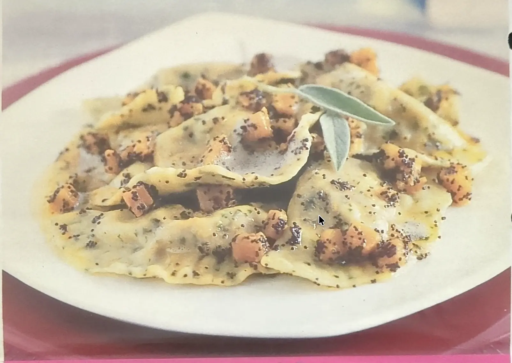

---
tags:
  - Zucca
  - Semi di papavero
  - Mela
  - Noci
---

## Ingredienti

### Per la pasta

| Ingredienti                  | Ingredienti             |
| ---------------------------- | ----------------------- |
| **300 g** - Farina | **1 mazzetto** - Erbe aromatiche (timo, maggiorana, salvia, rosmarino) |
| **3** - Uova | Sale |

### Per il ripieno

| Ingredienti                  | Ingredienti             |
| ---------------------------- | ----------------------- |
| **400 g** - Polpa di zucca | **1** - Mela golden |
| **70 g** - Gherigli di noce tritati | **1** - Arancia |
| Noce moscata | **30 g** - Burro |
| Sale e pepe | |

### Per il condimento

| Ingredienti                  | Ingredienti             |
| ---------------------------- | ----------------------- |
| **150 g** - Dadini di zucca | **120 g** - Burro |
| **1 cucchiaio** - Semi di papavero | Sale |

## Procedimento

### Per il ripieno

1. Taglia a dadini l a zucca e la mela sbucciata e rosolale nel burro. 
2. Sala, unisci un mestolino d'acqua calda e cuoci coperto per 15-20 minuti
3. Riduci tutto in purè e unisci una grattata di noce moscata, la scorza di mezza arancia grattugiata e le noci.

### Per la pasta

1. fai la fontana con la farina, metti al centro le uova, una presa di sale e le erbe tritate.
2. Comincia a lavorare per amalgamare gli ingredienti, quindi impasta fino a ottenere una pasta liscia. 
3. Falla riposare coperta per dieci minuti. 
4. Poi, tira la pasta in una sfoglia e ricavane tanti dischi di otto cm di diametro.
5. Distribuisci il ripieno al centro dei dischi, piegali a mezzaluna e salda i bordi con i rebbi di una forchetta.

### Per il condimento: 

1. Cuoci i dadini di zucca a vapore per otto minuti
2. Rosola nel burro i semi di papavero, unisci i dadini di zucca, sala e fai insaporire per un paio di minuti.
3. Lessa i ravioli in acqua salata, scolali e condiscili con il sugo preparato
