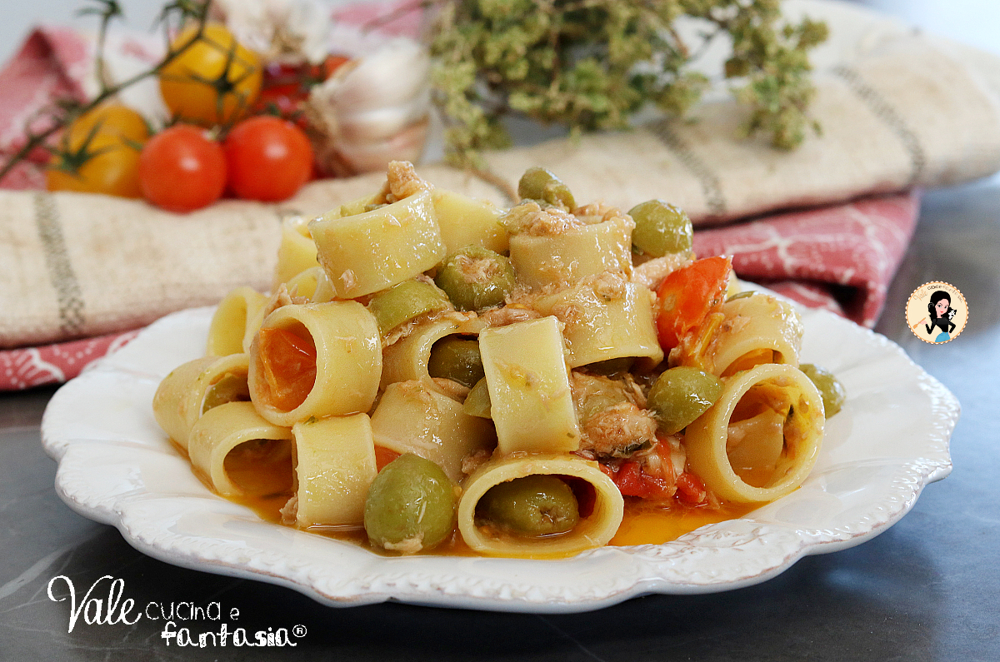

# Pasta ai due pomodori con tonno e olive

## Ingredienti

| Ingredienti | Ingredienti |
| --- | --- |
| **400 g** - Pasta | **1 cucchiaino** - Capperi |
| **150 g** - Tonno sott'olio | **2 filetti** - Alici sott'olio |
| **100 g** - Pomodorini datterini rossi | **20 g** - Olive verdi |
| **100 g** - Pomodorini gialli | **1 spicchio** - Aglio |
| Origano secco | Olio extravergine d'oliva |
| Sale | |

## Procedimento

### Per il sugo di tonno

1. In una padella fate scaldare l'olio, aggiungete lo spicchio d'aglio, le alici e lasciate insaporire per qualche secondo.
2. Aggiungete i capperi, le olive e il tonno e mescolate.
3. Unite anche i pomodorini gialli e rossi, salate, mescolate e lasciate cuocere il sugo per qualche minuto.

### Per la pasta

1. Cuocete la pasta in abbondante acqua salata e scolatela al dente nel condimento.
2. Saltatela in padella per qualche secondo e se occorre aggiungete poca acqua di cottura.
3. Aggiungete abbondante origano e servite subito la Pasta ai due pomodori con tonno e olive!

## Note

- Potete utilizzare i pomodorini che volete.
- Potete scegliere il formato di pasta che preferite.
- Potete non mettere le alici se non vi piacciono.

## Origine

[https://blog.giallozafferano.it/valeriaciccotti/pasta-ai-due-pomodori-con-tonno/](https://blog.giallozafferano.it/valeriaciccotti/pasta-ai-due-pomodori-con-tonno/)
