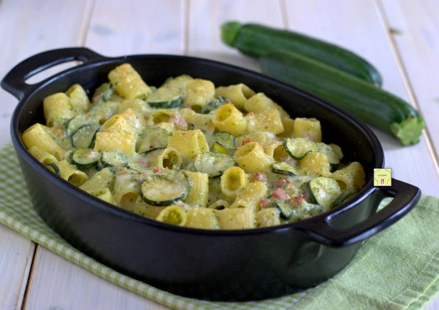

---
tags:
  - Pasta
  - Zucchine
  - Pancetta
  - Al forno
---
# Pasta al forno con zucchine e pancetta

## Ingredienti

| Ingredienti | Ingredienti |
| --- | --- |
| **380 g** - Pasta | **160 g** - Pancetta affumicata (in un'unica fetta) |
| **4** - Zucchine | **100 g** - Scamorza |
| **1** - Spicchio aglio | **200 ml** - Besciamella |
| Grana grattugiato | Olio extravergine d'oliva |
| Sale | |

## Procedimento

> Preriscaldare il forno a 200°

1. Lavate le zucchine, spuntatele e tagliatele a fette sottili.
2. Sbucciate lo spicchio di aglio e tritatelo.
3. Tagliate la pancetta a dadini.
4. Scaldate un filo di olio in una padella ampia e fateci soffriggere l'aglio tritato e la pancetta fino a quando quest'ultima non sarà croccante.
5. Aggiungete le zucchine, aggiustate di sale e fate cuocere per una decina di minuti.
6. Prelevate metà delle zucchine, frullatele con due cucchiai di formaggio grattugiato e versate la crema nella padella, mescolando.
7. Tagliate la scamorza a dadini.
8. Cuocete la pasta in abbondante acqua salata bollente per qualche minuto in meno del tempo indicato.
9. Scolatela e mescolatela al condimento, besciamella e scamorza.
10. Versate tutto in una pirofila e cospargete con grana grattugiato.
11. Infornate a 200° per venti minuti.
12. Sfornate, fate riposare qualche minuto e servite.

## Origine

[Pasta al forno con zucchine e pancetta - Chez Bibia](https://blog.giallozafferano.it/chezbibia/ricetta-pasta-al-forno-con-zucchine-e-pancetta/)
