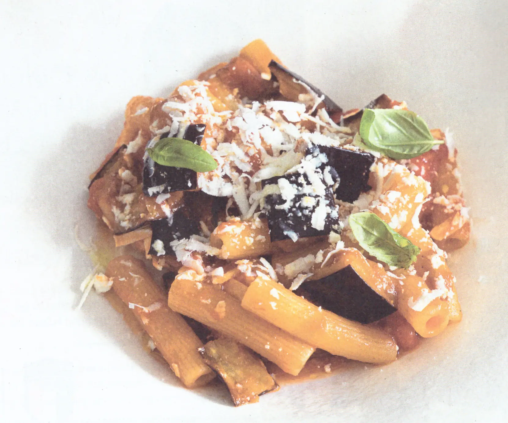

## Ingredienti

| Ingredienti                  | Ingredienti             |
| ---------------------------- | ----------------------- |
| **320 g** - Pasta (sedani rigati) | **400 g** - Pomodori pelati |
| **500 g** - Melanzane | **140 g** - Ricotta salata |
| Basilico | **1 spicchio** - Aglio |
| Olio di semi | Olio evo |

## Procedimento

1. In una padella scaldare un filo di olio extra vergine d'oliva e aggiungere uno spicchio d'aglio schiacciato e i gambi del basilico.
2. Far insaporire per qualche minuto, poi versare i pomodori pelati precedentemente schiacciati. 
3. Regolare di sale e cuocere per 15-20 minuti a fiamma bassa.
4. Nel frattempo lavare le melanzane e tagliarle a cubetti di circa due centimetri.
5. Friggere i cubetti di melanzana in abbondante olio di semi a 175-180°C e poi scolarli su carta assorbente.
6. Cuocere la pasta in acqua salata e scolarla molto al dente nel sugo di pomodoro.
7. Aggiungere le melanzane fritte nella padella con la pasta e il sugo di pomodoro e terminare la cottura.
8. Mantecare con una grattugiata di ricotta salata e servire con qualche foglia di basilico.

