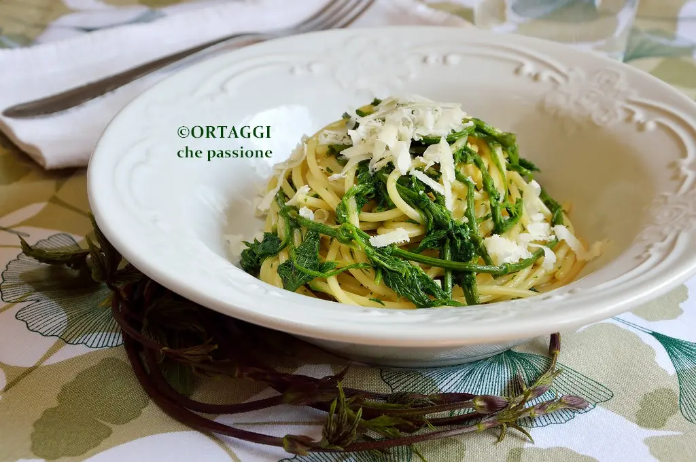

---
tags:
  - Pasta
  - Bruscandoli
  - Luppolo
---
# Pasta con bruscandoli

## Ingredienti

| Ingredienti | Ingredienti |
| --- | --- |
| **80 g** - Bruscandoli (vanno bene anche gli asparagi selvatici o gli agretti) | **180 g** - Spaghetti |
| **1 filo** - Olio extravergine d'oliva | |

## Procedimento

1. Lavare bene le cime di luppolo.
2. Portare ad ebollizione l'acqua per la pasta, salare.
3. Versare prima gli spaghetti e dopo pochi minuti i bruscandoli interi.
4. Una volta cotti, scolarli e condirli con un filo d'olio buono (se gradito piccante) oppure saltarli in padella con olio extravergine di oliva e aglio.

## Note

- Per i vegani: cospargere di lievito alimentare in scaglie o granella di frutta secca.
- Per i vegetariani: insaporire con del formaggio grattugiato, del burro fuso oppure del formaggio cremoso.
- Con pesce: saltare la pasta in un soffritto di filetti di alici e aglio oppure diluire la pasta di acciughe con dell'acqua di cottura.
- Per gli onnivori: si può accompagnare con un soffritto di pancetta o salsiccia, oppure amalgamare con del tonno sottolio sminuzzato.
- Stagione di raccolta: da marzo a maggio.

## Origine

[Pasta con bruscandoli - Ortaggi che passione](https://blog.giallozafferano.it/ortaggichepassionebysara/pasta-con-bruscandoli/)
