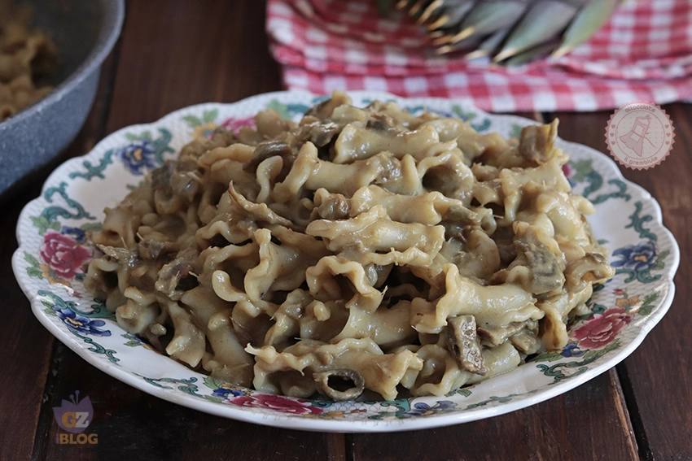

---
tags:
  - Carciofi
  - Pasta
---
# Pasta con crema di carciofi

## Ingredienti

| Ingredienti | Ingredienti |
| --- | --- |
| **320 g** - Pasta | **50 g** - Parmigiano grattugiato |
| **3** - Carciofi | Olio extravergine d'oliva |
| Sale | |

## Procedimento

### Per pulire i carciofi

1. Prendete i carciofi e togliete le foglie esterne più dure e la parte del gambo più dura.
1. Tagliate le punte dei carciofi e tagliateli a metà.
1. Eliminate la barbetta interna dei carciofi e metteteli in una ciotola piena di acqua fredda e limone in modo che non anneriscano.

### Per cuocere i carciofi

1. Tagliate i carciofi a fettine molto sottili.
1. Mettete a scaldare 2 cucchiai di olio extravergine di oliva in una padella e mettete a cuocere i carciofi a fuoco alto per qualche minuto.
1. Aggiungete una presa di sale e un po' di acqua poi abbassate il fuoco, mettete il coperchio e fate cuocere i carciofi per 15 o 20 minuti fino a che saranno cotti e morbidi.

### Per la crema di carciofi

1. Prelevate circa i due terzi di carciofi cotti e metteteli in un contenitore alto e stretto.
1. Aggiungete olio extravergine di oliva e parmigiano grattugiato.
1. Frullate con il frullatore ad immersione fino ad ottenere una crema omogenea.
1. Mettete la crema di carciofi nella padella dove avete cotto i carciofi.

### Per la Pasta con crema di carciofi

1. Fate bollire una pentola di acqua leggermente salata e mettete a cuocere la pasta.
1. Scolate la pasta al dente direttamente nella padella con il condimento.
1. Aggiungete un mestolo abbondante di acqua di cottura della pasta e aggiungete anche i restanti carciofi cotti a fettine che non avete frullato.
1. Mescolate e aggiustate di sale se necessario e aggiungete ancora acqua di cottura della pasta se la volete più cremosa.

## Note

- Potete aggiungere pancetta o guanciale croccante.
- Potete unire speck a listarelle per un sapore più deciso.
- Potete aggiungere ricotta o robiola.
- Potete sostituire il parmigiano con pecorino.
- Potete aggiungere scorza di limone grattugiata per dare freschezza.
- Potete unire pinoli tostati.
- Potete aggiungere prezzemolo o menta fresca tritata.
- Potete usare pasta integrale o senza glutine.
- Potete aggiungere gamberi per una versione di mare.
- Potete aggiungere uno spicchio di aglio in cottura per aromatizzare.
- Potete usare anche cuori di carciofo già puliti per velocizzare.
- Pulite bene i carciofi eliminando tutte le parti dure.
- Mettete subito i carciofi in acqua e limone per evitare che anneriscano.
- Tagliate i carciofi sottili per cuocerli più velocemente.
- Non cuoceteli a fuoco troppo basso all'inizio: devono rosolare leggermente.
- Aggiungete poca acqua alla volta durante la cottura.
- Frullate i carciofi quando sono ancora caldi per ottenere una crema liscia.
- Tenete sempre da parte acqua di cottura della pasta.
