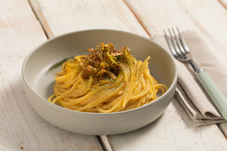

---
tags:
  - Zucca
  - Taleggio
---

## Ingredienti

### Spaghetti

| Ingredienti                  | Ingredienti             |
| ---------------------------- | ----------------------- |
| **320 g** - Spaghetti | **100 g** - Cavolo nero (già pulito) |
| Olio evo | |

### Crema

| Ingredienti                  | Ingredienti             |
| ---------------------------- | ----------------------- |
| **400 g** - Zucca | **100 g** - Taleggio |
| **200 g** Acqua | Sale fino |

### Porro fritto

| Ingredienti                  | Ingredienti             |
| ---------------------------- | ----------------------- |
| **200 g** - Porro | Olio di semi |

## Procedimento

> Preriscaldare il forno a 170°

1. Per preparare la pasta con crema di zucca e taleggio, iniziate dal cavolo nero: separate le foglie dai gambi , poi disponetele in una teglia foderata con carta forno, distanziandole leggermente fra loro . Cuocete in forno preriscaldato ventilato a 170° per 20 minuti. 
2. Nel frattempo occupatevi della zucca: pulitela dai semi e dai filamenti interni. Tagliatela in 4 parti, poi mettetela in una ciotola e coprite con pellicola. 
3. Cuocete in microonde per 5 minuti alla massima temperatura. Una volta cotta, prelevate la polpa con un cucchiaio.
4. Trasferite la polpa in un boccale, poi aggiungete l’acqua e il sale. Frullate con un mixer a immersione per ottenere una crema liscia e omogenea e tenete da parte.
5. A questo punto il cavolo nero sarà cotto, le foglie dovranno risultare secche e asciutte. 
6. Inseritele in un macinaspezie e frullate per ottenere una polvere.
7. Passate al porro: mondate il porro e affettatelo finemente. Scaldate l’olio di semi fino alla temperatura di 180° e friggete le rondelle di porro per un minuto circa, fino a doratura. 
8. Scolate e trasferite su carta assorbente o per fritti.
9. Ora cuocete gli spaghetti in acqua bollente salata. Intanto scaldate la crema di zucca in un pentolino, poi unite il taleggio a tocchetti e mescolate a fuoco dolce per scioglierlo completamente.
10. Scolate la pasta a un minuto dalla fine del tempo di cottura e trasferitela in una padella capiente con un goccio di acqua di cottura, poi aggiungete la crema di zucca e taleggio e mescolate bene per amalgamare. 
11. Infine mantecate con un filo d’olio e un pizzico di pepe.
12. Impiattate e guarnite con la polvere di cavolo nero, aiutandovi con un colino, e il porro fritto. La vostra pasta con crema di zucca e taleggio è pronta per essere servita!

## Note

- Se non avete un macinaspezie potete sbriciolare le foglie di cavolo nero con le mani.
- In alternativa al microonde, potete cuocere la zucca al forno: tagliatela a metà, pulitela e infornatela a 200° per circa 45 minuti o a che risulterà morbida.
- I gambi del cavolo scartati si possono utilizzare per arricchire un brodo vegetale.