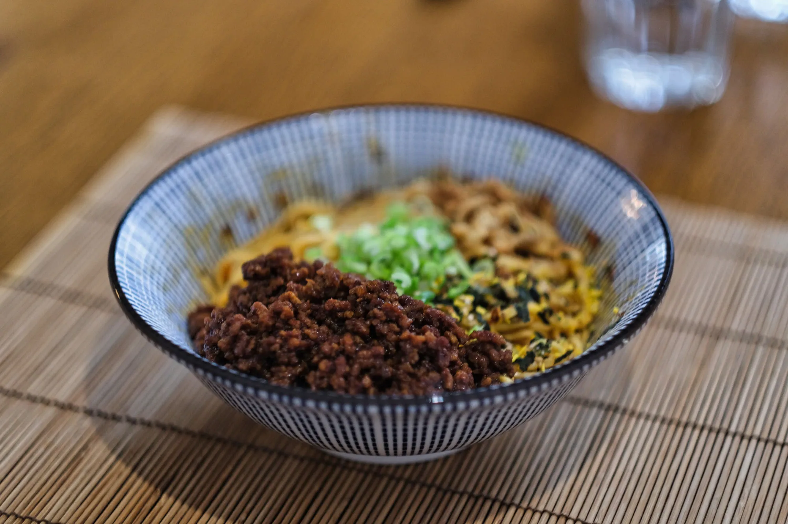

---
tags:
  - Maiale
  - Giapponese
---
# Pork Soboro: The Japanese Ragù

## Ingredienti

| Ingredienti | Ingredienti |
| --- | --- |
| **15 ml (1 tbsp)** - Vegetable oil (roasted sesame seed oil recommended) | **0.5 kg** - Ground pork |
| **1/2** - White onion, diced finely | **2 cloves** - Garlic, minced |
| **2 "coins"** - Fresh ginger, minced | **30 ml (2 tbsp)** - Soy sauce |
| **15 ml (1 tbsp)** - Mirin | **15 ml (1 tbsp)** - Sake |
| **15 ml (1 tbsp)** - Water | **30-45 ml (2-3 tbsp)** - Sweet bean paste |
| **to taste** - Salt and MSG | |

## Procedimento

1. Heat oil in a large pan over medium heat; sweat diced onion until translucent (3-5 minutes).
2. Add minced garlic and ginger, cook until fragrant (approximately 1 minute).
3. Increase heat to high; add ground pork, stirring constantly to break up clumps until browning begins.
4. Add soy sauce, mirin, sake, sweet bean paste, salt, and MSG; continue cooking until pork becomes glossy, fully cooked, and flavorful.
5. Adjust seasonings as needed.

## Note

- Refrigerate in airtight container for 3-5 days; freeze for up to 1 month. Reheat in saucepan; add water and sesame oil if too thick.

## Origine

[Pork Soboro: The Japanese Ragù - The Ramen Bowl](https://theramenbowl.substack.com/p/pork-soboro-the-japanese-ragu)
