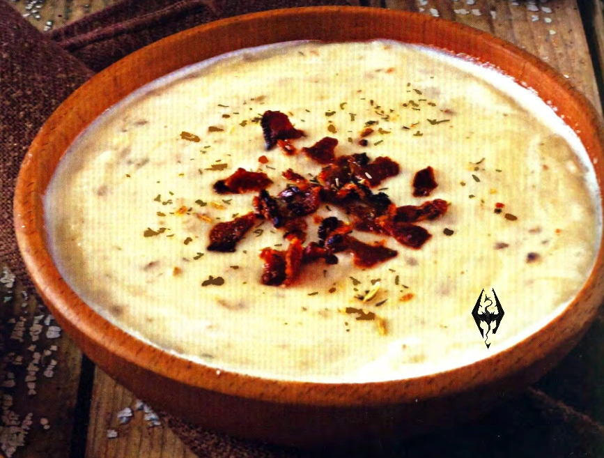

---
tags:
  - Patate
  - Cheddar
---
# Potato cheddar soup

## Ingredienti

| Ingredienti                  | Ingredienti             |
| ---------------------------- | ----------------------- |
| **2 tablespoon** - Unsalted butter | **2 cups** - Chicken broth |
| **1** - Small onion, minced | **$\frac{1}{2}$ cup** - whole milk |
| **2 tablespoon** - All-purpose flour |  |

## Procedimento

1. Melt the butter in a medium saucepan over medium heat. 
2. Add the onion and cook for several minutes, until the onion is soft and fragrant. 
3. Sprinkle the flour in and stir to combine before continuing to cook for a few minutes more, until the flour is fully incorporated.
4. Add the chicken broth and milk, followed by the cubed potatoes. 
5. Turn up the heat so the mixture simmers, and cook until the potatoes are quite soft, about 15 minutes. 
6. Using an immersion blender or a potato masher, blend the soup until it is an even texture. 
7. Add the cheddar cheese, Seasoning, and just enough of the cream to get the consistency you like. 
8. Ladle into serving dishes and top with crumbled bacon, if desired.
