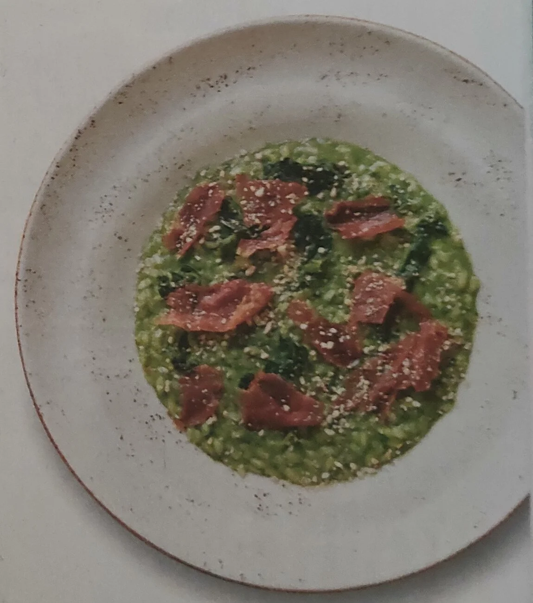

---
tags:
  - Spinaci
  - Prosciutto crudo
  - Mandorle
---

## Ingredienti

| Ingredienti                  | Ingredienti             |
| ---------------------------- | ----------------------- |
| **280 g** - Riso Vialone nano | **300 g** - Spinaci freschi |
| **100 g** - Prosciutto san Daniele | **1 bustina** - Mandorle |
| **1/2 l** - Brodo vegetale | **100 g** - Parmigiano reggiano |
| **50 g** - Burro | Olio evo |
| Sale | Pepe |

## Procedimento

> Preriscaldare il forno a 170°

1. In una padella, stufare circa 5 minuti gli spinaci con un po' d'olio, una noce di burro, sale, pepe. 
2. Poi frullarli con un po' di acqua e olio, fino a creare una crema liscia. 
3. In una casseruola, tostare il riso con una noce di burro e un po' di sale, fino al leggero imbrunimento dei chicchi. 
4. Poi bagnare con del brodo caldo e cuocere il riso per circa 12 minuti, aggiungendo altro brodo man mano che si asciuga.
5. Nel frattempo rendere croccante il prosciutto cuocendolo in forno a 170°C per 5 minuti e tenerlo da parte. 
6. Frullare le mandorle fino a ottenere una farina, quindi tostarla in padella per circa 3 minuti. 
7. Una volta cotto il riso, aggiungere la purea di spinaci, un po' di brodo e lasciar riposare per 2-3 minuti. 
8. Aggiungere il Parmigiano Reggiano grattugiato, una noce di burro e mantecare con un movimento energico per rendere il risotto più cremoso.
9. Servire con il prosciutto croccante e la polvere di mandorle tostate.
