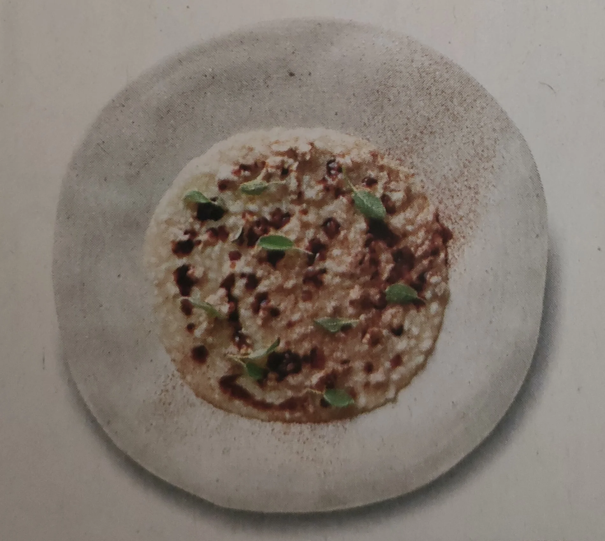

## Ingredienti

| Ingredienti                  | Ingredienti             |
| ---------------------------- | ----------------------- |
| **200 g** - Lombata di maiale | **200 g** - Vitello magro |
| **200 g** - Riso vialone nano | **1/2 l** - Brodo di carne |
| **100 g** - Parmigiano reggiano | Burro |
| Rosmarino | Cognac (BRandy) |

## Procedimento

1. Cuocere con un po' di burro e un rametto di rosmarino il maiale e il vitello tagliati a dadini.
2. Sfumare con un bicchierino di cognac e lasciar riposare. 
3. Tostare 200 g di Riso Nano Vialone e cuocerlo in 1/2 l di brodo di carne per circa 12 minuti. 
4. Far riposare, aggiungere la carne e mantecare con 100 g di Parmigiano Reggiano grattugiato e una spolverata di cannella.
