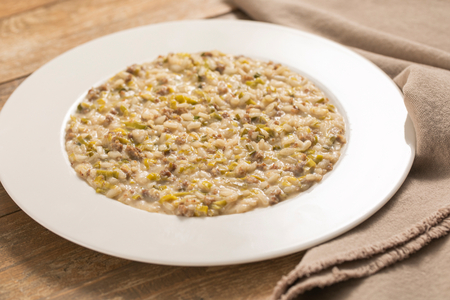

---
tags:
  - Porro
  - Salsiccia
---

## Ingredienti

### Per il riso

| Ingredienti                  | Ingredienti             |
| ---------------------------- | ----------------------- |
| **320 g** - Riso carnaroli | **300 g** - Salsiccia |
| **1 l** - Brodo vegetale | **100 g** - Vino bianco secco |
| **30 g** - Burro | Sale e pepe |

### Per mantecare

| Ingredienti                  | Ingredienti             |
| ---------------------------- | ----------------------- |
| **80 g** - Mascarpone | **40 g** - Burro freddo |
| **50 g** - Parmigiano | |

## Procedimento

1. Rimuovete la parte verde dei porri e affettateli a rondelle sottili. Eliminate il budello dalla salsiccia e sbriciolatela con le mani.
2. In una casseruola capiente fate sciogliere il burro, poi aggiungete la salsiccia e rosolatela per qualche minuto a fuoco vivace, mescolando spesso.
3. Quando sarà bella dorata, unite i porri e cuocete a fiamma media per circa 5 minuti, fino a quando si saranno ammorbiditi. 
4. A questo punto versate il riso nella casseruola e tostatelo per un paio di minuti, mescolando bene per amalgamarlo al resto degli ingredienti.
5. Salate e sfumate con il vino bianco, poi lasciate evaporare completamente la parte alcolica. 
6. Ora iniziate a bagnare il riso con un mestolo di brodo per volta, aspettando sempre che venga assorbito prima di aggiungerne un altro. 
7. Proseguite in questo modo per circa 15-18 minuti, fino a che il riso sarà a cottura.
8. Una volta cotto, spegnete il fuoco e mantecate con mascarpone, burro e Parmigiano Reggiano grattugiato.
9. Coprite con il coperchio e lasciate riposare per un paio di minuti, prima di mescolare energicamente per amalgamare il tutto. 
10. Infine regolate di sale e di pepe.

