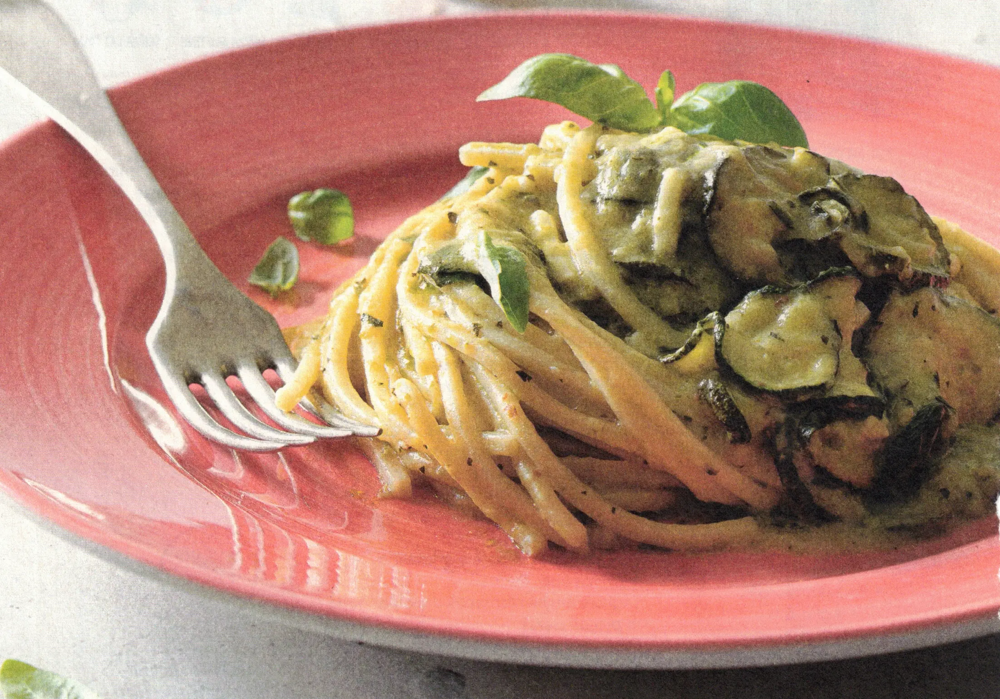

## Ingredienti

| Ingredienti                  | Ingredienti             |
| ---------------------------- | ----------------------- |
| **400 g** - Spaghetti alla chitarra | **700 g** - Zucchine |
| Olio evo | Aglio |
| Sale e pepe | **200 g** - Provolone |
| Foglie di basilico spezzettate | Olio di semi |
| Parmigiano | |

## Procedimento

1. Mondare le zucchine e affettarle a rondelle molto sottili.
2. In una padella versare abbondante olio di semi di arachide fino a riempirlo di due dita.
3. Scaldare l'olio a 170°C e friggere le rondelle di zucchine.
4. Scolarle su carta assorbente e tamponarle delicatamente in modo da assorbire più olio possibile.
5. Portare a bollore una pentola con un po' d'acqua, immergere le zucchine fritte e scolarle dopo qualche secondo.
6. Frullarne due terzi con olio a filo e regolare di sale.
7. In una padella capiente scaldare un po' d'olio, aggiungere uno o due spicchi d'aglio e farli rosolare a fiamma bassa per 5 minuti.
8. A questo punto, aggiungere le zucchine frullate e cuocerle fino a renderle cremose.
9. Nel frattempo cuocere gli spaghetti alla chitarra in acqua bollente salata e scolarli al dente.
10. Aggiungere le restanti zucchine fritte e la pasta nella padella e mescolare per pochi minuti. Spegnere il fuoco, grattugiare il Provolone del Monaco grossolanamente e aggiungerlo nella padella.
11. Mescolare la pasta fino a quando il formaggio sarà completamente sciolto e si sarà formata una cremina.
12. Ultimare con il basilico spezzettato, una grattugiata di pepe e servire.

