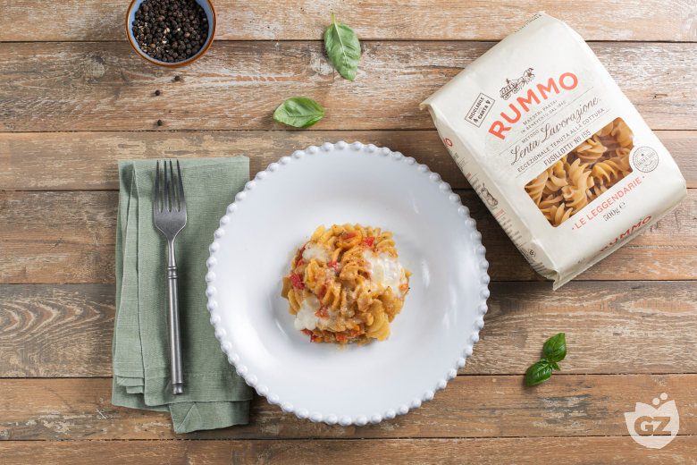

## Ingredienti

### Per la pasta

| Ingredienti                  | Ingredienti             |
| ---------------------------- | ----------------------- |
| **320 g** - Fusillotti | **200 g** - Fiordilatte |
| **65 g** - Grana padano | Basilico |

### Per il ragù vegetale

| Ingredienti                  | Ingredienti             |
| ---------------------------- | ----------------------- |
| **80 g** - Cipolla rossa di tropea | **80 g** - Cipollotto fresco |
| **70 g** - Carote | **200 g** - melanzane |
| **60 g** - Peperoni | **100 g** - Pomodorini datterini gialli |
| **100 g** - Pomodori cuore di bue | basilico |
| **100 g** - Brodo vegetale | Sale |

## Procedimento

1. Per preparare la pasta gratinata con ragù vegetale, mondate il cipollotto eliminando la parte finale e le estremità, quindi affettatelo sottilmente. Pelate la carota con un pela verdure e tritatela finemente al coltello. Sbucciate la cipolla rossa e tagliatela a fettine sottili.
1. Versate un giro d'olio in una casseruola, unite il cipollotto, la carota e la cipolla e lasciate soffriggere a fiamma bassa per una decina di minuti, mescolando spesso. Intanto pelate la melanzana ed eliminate le estremità.
1. Tagliatela prima a fette e successivamente a bastoncini. Mondate il peperone, tagliatelo a metà eliminate il picciolo, i semi e i filamenti interni, quindi tagliatelo a listarelle sottili.
1. Tagliate i pomodorini gialli a metà. Dividete il pomodoro cuore di bue a metà, eliminate la parte centrale più dura e riducetelo a cubetti. Quando il soffritto sarà ben appassito unite la melanzana e il peperone.
1. Aggiungete anche il pomodoro a cubetti, salate e mescolate accuratamente. 
1. Versate circa 100 g di brodo vegetale o acqua, coprite con il coperchio e lasciate cuocere per circa 15 minuti a fuoco medio. Trascorso il tempo di cottura unite i pomodorini gialli.
1. Aggiungete anche il basilico spezzettato a mano, poi mescolate e spegnete il fuoco. Nel frattempo cuocete i fusillotti in abbondante acqua bollente salata, per metà del tempo indicato sulla confezione.
1. Scolate la pasta direttamente nel ragù vegetale e amalgamate bene il tutto. Versate metà della pasta in una pirofila da 28 cm. Distribuite sopra una spolverizzata di grana grattugiato.
1. Sbriciolate grossolanamente anche metà del fior di latte e spargetelo sulla pasta. Coprite con la restante pasta e completate con il fiordilatte rimasto.
1. Aggiungete anche il grana grattugiato. Cuocete in forno ventilato preriscaldato a 230 °C per 15-20 minuti, fino a ottenere una superficie ben gratinata e dorata. Sfornate, completate con qualche fogliolina di basilico fresco e servite. 

## Note

- La pasta gratinata con ragù vegetale si conserva in frigorifero, in un contenitore chiuso ermeticamente, per 2 giorni. Al momento di servirla potete riscaldarla in forno oppure al microonde fino a quando sarà ben calda. Si sconsiglia la congelazione.
- Per una gratinatura ancora più croccante potete aggiungere in superficie un cucchiaio di pangrattato mescolato al formaggio grattugiato.
- Se preferite un sapore più intenso, sostituite parte del fiordilatte con della scamorza affumicata.

